# סיגמה 2.0 — מסמך דרישות ואפיון מערכת (SRS)

> מערכת תפעול שטח של סיגמטק — דרישות, ארכיטקטורה ותהליכים · לסוקר מערכות חיצוני

**גרסת המסמך:** 1.0 · 19.9.2026 · ענף `feat/kibbutz-cards-redesign` · HEAD `67c36c9` (לפני שחרור 2.00)
**כותב:** סוכן תיעוד (Task 19 בתוכנית ההרצה) · **קהל:** מנתח/סוקר מערכות שצריך להכריע "אפשרי · הגיוני · טוב"
**מקורות:** שלושת מסמכי האפיון, תוכנית ההרצה (Tasks 0–30), יומן ההכרעות (`progress.md`), `docs/integration-map.md`,
דוחות UX/אימוץ/כיסוי-פרישה, קבצי `db/*.sql`, `supabase/functions/*`, `qa/`.
**כלל כתיבה:** לא הומצאה כאן שום דרישה חדשה. כל פער בין המקורות מופיע כפריט **פתוח** בסעיף 7.

---

## 0 | איך לקרוא את המסמך

| סעיף | מה תמצא בו | למה זה משנה לסוקר |
|---|---|---|
| 1 | מטרה, היקף, תפקידים ופרסונות | מי המשתמשים ומה כל אחד בא לעשות |
| 2 | חמישה תהליכים עסקיים כתרשימי מסלולים | האם המודל תואם את העבודה בפועל |
| 3 | דרישות פונקציונליות FR-01…FR-64 | מה המערכת עושה, איך יודעים שזה עובד |
| 4 | דרישות לא-פונקציונליות | ביצועים, אבטחה, פרטיות, זמינות |
| 5 | ארכיטקטורה: C4, ERD, אפיק אירועים, גשר, בנייה ופריסה, סודות | האם זה בר-מימוש ומתוחזק |
| 6 | זרימות נתונים עם מצבי כשל ונסיגה | מה קורה כשמשהו נופל |
| 7 | סיכונים, הכרעות פתוחות, שחרור מדורג | מה עוד לא סגור |
| 8 | מטריצת עקיבות: בקשה → אפיון → משימה → בדיקה | אין דרישה יתומה |
| 9 | מילון מונחים עברית/אנגלית | — |
| נספח א | צ'קליסט לסוקר | השאלות שהמסמך אמור לענות עליהן בישיבה אחת |
| נספח ב | בדיקה עצמית של המסמך | הוכחה שהכיסוי מלא |

**מוסכמות סימון:** `FR-xx` דרישה פונקציונלית · `NFR-xx` לא-פונקציונלית · `T-nn` משימה בתוכנית ההרצה ·
`§x` סעיף באפיון · 🟢 נבנה ונסקר · 🟡 נבנה, ממתין לפריסת ייצור · 🔵 מתוכנן ולא נבנה.

---

## 1 | מטרה, היקף, תפקידים ופרסונות

### 1.1 מטרת המערכת
סיגמטק מנהלת מערכות מדידה וחיוב אנרגיה (חשמל · מים · גז) עבור קיבוצים. העבודה היומית מתרחשת בשלושה עולמות
נפרדים — מערכת ה-EMS (משימות מול הלקוח), ישיבת החברה השבועית (החלטות), והשטח (ביקורים, ציוד, תעודות משלוח).
**סיגמה 2.0 היא שכבת התפעול שמחברת את השלושה:** כרטיס קיבוץ אחד שמרכז את מצבו, זרימת שטח שמסתיימת בסיכום ביקור
מתועד, וסגירת מעגל ניהולית מישיבת החברה אל משימות EMS אמיתיות.

### 1.2 היקף
**בהיקף:** כרטיסי קיבוצים מבוססי-נתונים · בולטי ישיבה לכל קיבוץ · משימות EMS מלאות · צ'ק-אין ובריפינג שטח +
תזכורת 2 שעות · טיוטות ביקור · יומן מאוחד עם מסלול יום · נוכחות וחגים · פערים אישיים · הגדרות אישיות ·
תיבת רעיונות/באגים עם תמלול · יומן שטח חופשי מבוסס AI · אנליטיקת שימוש · מצב ישיבה ומסך סקירה · משימות פנימיות ·
תבנית קליטת לקוח חדש · מדד בריאות קיבוץ (טיוטה) · שעות עבודה מול Clockify · עמוד פיתוח · פרויקט 🔥 צריבות (זמני).

**מחוץ להיקף בשחרור זה:** קליטת מיילים מ-Gmail (`gmail-intake`) — עידן לא אישר (§8b) · מלאי אחוד (מתוכנן ל-2.01) ·
שליחת דואר מהאפליקציה (הכרעת G5) · הקלטת ישיבה בדפדפן (נסגר ב-§8b — עידן מקליט מקומית) · ייבוא אוטומטי מ-Drive ·
מתאם `ems-mcp` (הממשק קיים, המימוש ימתין לשרת MCP של ה-EMS).

### 1.3 תפקידים ופרסונות

| תפקיד | פרסונה | שאלת הבוקר שלו | מסך נחיתה (§7l) | הרשאות עיקריות |
|---|---|---|---|---|
| מנהל מוצר / תפעול | **עידן** | "מה דורש הכרעה שלי היום?" | היום שלי (PM) | הכל: ייבוא ישיבה, יצירת קיבוץ, סוגי אנרגיה, שמות לדוחות, אנליטיקה, Clockify |
| מנכ"ל | **עמיחי** | "איפה יש צרה?" | סקירה | קריאה רוחבית, יצירת קיבוץ, אישור הזמנות, דייג'סט מלאי, פערים לכל אדם |
| טכנאי שטח | **אביאם**, **ניתאי** | "לאן אני נוסע ומה אני חייב לסגור?" | קיבוצים + גיליון הגעה | צ'ק-אין, סיכום ביקור, תעודת משלוח, צריבות, נוכחות |
| מפתח | **מתניה**, **אליה** | "מה בבדיקות אצלי?" | לוח פיתוח | לוח פיתוח, ישיבת פיתוח; מתניה גם ▶ Clockify |
| צופה / דוחות | **צופה** (הנהלת חשבונות) | "איך אני מוציאה את הדוח?" | מרכז הדוחות | קריאה בלבד + כל הייצוא; חסימת כתיבה נבדקת רגרסיבית בכל משימה |
| שחקן חיצוני | **הקיבוץ** | — | — | אינו משתמש באפליקציה; רואה רק מה שהועלה ל-EMS כמשימה |

**כללי גישה חוצי-תפקידים:**
- `FR-00` **שום נתון לא נטען בלי התחברות EMS תקפה** (§7n): כל אי (island) בודק `isEmsConnected()` ומרנדר גיליון
  התחברות במקום תוכן. `?login=0` הוא מצב בדיקה בלבד ומושבת במקור הייצור.
- כניסת הצופה נסגרת בקוד צפייה שנבדק **בצד השרת** (`ems-auth` mode `viewer` + סוד `VIEWER_PIN`), עם חסימת
  ניחושים (6 ניסיונות / 15 דק' לכתובת, `auth_attempts`).
- שני כללי ניסוח מחייבים (§7h): הממשק **לא מסביר את עצמו** (אסור "נשמר ל-Supabase", "RLS", "בדיקה אוטומטית"),
  ו**לעולם אינו אומר למשתמש מי עוד רואה את הנתונים שלו**. שתי הבדיקות הן contract tests על מחרוזות ה-UI.

---

## 2 | התהליכים העסקיים

### 2.1 לולאת ישיבת החברה (ראשון)

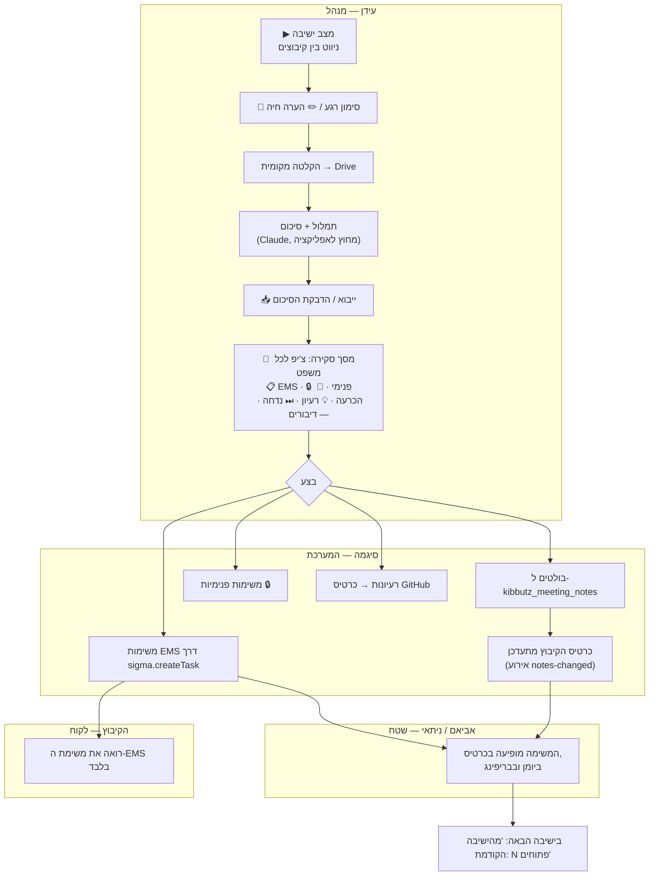

### 2.2 יום שטח (צ'ק-אין → בריפינג → סיכום → נדנוד)

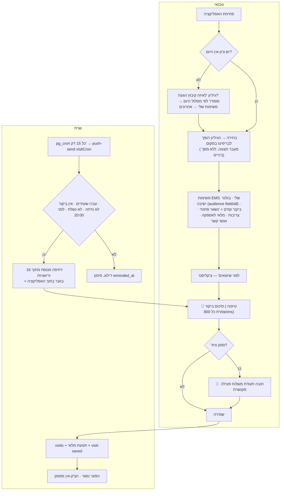

### 2.3 הזמנה → מלאי → ביקור → תעודת משלוח

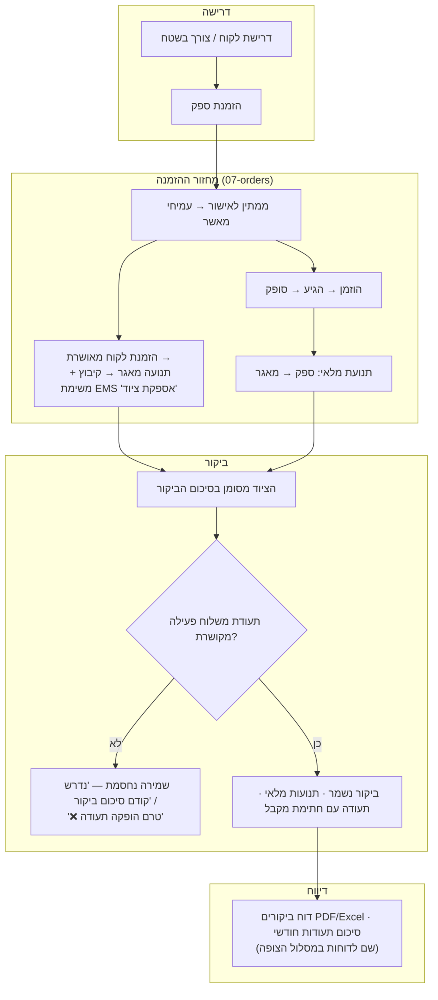
*הערה: המעבר למאגר חברה אחד (`חברה`) הוא אפיון המלאי האחוד — **2.01**, לא בשחרור זה. היום מקור המלאי הוא
המיקום של המשרד/העובד (ראה פריט פתוח O-3).*

### 2.4 קליטת לקוח חדש (Onboarding)

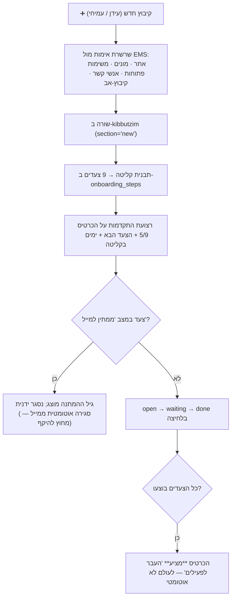

### 2.5 שעות → דוח (Clockify)

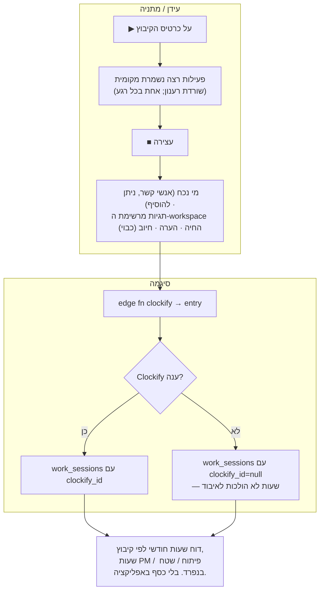

---

## 3 | דרישות פונקציונליות

לכל דרישה: קריטריון קבלה, הבדיקה שמוכיחה אותה (מתוך התוכנית והמאגר), סעיף האפיון, המשימה שמימשה אותה, וסטטוס.
🟢 נבנה ונסקר · 🟡 נבנה, ממתין לפעולת ייצור · 🔵 מתוכנן ולא נבנה.

### 3.1 כרטיסי קיבוצים (M-CARDS)

| FR | דרישה | קריטריון קבלה | בדיקה | אפיון | משימה | סטטוס |
|---|---|---|---|---|---|---|
| FR-01 | הכרטיסים הם נתונים, לא HTML סטטי | כל שורה ב-`kibbutzim` מרנדרת כרטיס אחד בדיוק; שורה מארכבת אינה מרונדרת | `test-kibbutzim.mjs` contract + golden של `buildCardHtml` | §7b | T1 | 🟢 |
| FR-02 | שני מדורים בלבד: 🆕 לקוחות חדשים · ✅ לקוחות פעילים; "בתהליך שיווקי" הוא תג ולא מדור | צ'יפים: הכל · חדשים · פעילים · 🤝; הסינון קורא `data-section` ו-`data-marketing` | golden `groupBySection` + מטריצת סינון | §2 | T1 | 🟢 |
| FR-03 | סדר: קיבוץ לפי איזור לפי `REGION_ORDER`, א״ב he-IL בתוך איזור, תווית איזור עדינה | תווית אינה מרונדרת כשלמדור איזור יחיד; "ללא איזור" לא קיים בייצור | golden סידור + אימות נתוני הייצור (0 איזורים ריקים) | §7b | T1 | 🟢 |
| FR-04 | הסרה מוחלטת של הזרימה/פרוצדורה/צינור/שלב N, אחראים, סטטוס חופשי, תצוגה מצומצמת, פס התקדמות ומדור עדיפות | אין מחרוזת ממשק המכילה זרימת נתונים / פרוצדורה / צינור / שלב N | contract sweep על מחרוזות הממשק | §2 | T1, T18a | 🟢 |
| FR-05 | פעולות מהירות בתחתית הכרטיס, ורק כשיש להן תכלית | 🚚 מרונדר רק כשיש מה לספק (הזמנת לקוח פתוחה או מוצרים בטיוטה) עם מונה; הצופה רואה 🗓 בלבד | `cardActionsFor(role)` matrix + `visibleActions(role, context)` | §3.3 | T1b | 🟢 |
| FR-06 | יצירת קיבוץ או תת-אתר מתוך האפליקציה, בלי שינוי קוד | שמירה → הכרטיס מופיע לכולם בטעינה הבאה; ארכוב במקום מחיקה | `validateKibbutz` goldens + מטריצת `canManageKibbutzim` | §7b | T1b | 🟢 |
| FR-07 | שרשרת אימות EMS לתת-אתר: חמישה צעדים, כולם רצים גם אם אחד נכשל | לכל צעד ✓/⚠️/✗ עם הערך שנמשך; אפשר לשמור ללא קישור; אתר שכבר משויך מפיק אזהרה | `emsChainReduce` goldens (ארבעה מצבים) | §7b | T1b | 🟢 |
| FR-08 | סוגי אנרגיה ניתנים לעריכה רק לעידן; איזור — לעידן ולעמיחי | גוף העדכון של משתמש שאינו עידן אינו כולל שדה אנרגיה | `kibbutzimSaveBody(row,user)` matrix | §7b | T1b | 🟢 |
| FR-09 | קוד הקיבוץ הישן אינו מוצג על הכרטיס, רק בכותרת המודאל והבריפינג | בדיקת רינדור על הכרטיס | render test | §2 | T4 | 🟢 |
| FR-10 | היררכיית תוכן בכרטיס: משימות EMS (פעולה) מעל בולטי ישיבה (היסטוריה) | הבולטים מכווצים לשורה-שתיים + "עוד N" | render test | §7k #7 | T4 | 🟢 |

### 3.2 בולטי ישיבה (M-NOTES)

| FR | דרישה | קריטריון קבלה | בדיקה | אפיון | משימה | סטטוס |
|---|---|---|---|---|---|---|
| FR-11 | פרסור סיכום ישיבה: מדור לכל קיבוץ, בולט לכל משפט, "אחריות X" הופך לבעלים | תאריך וסוג מזוהים מהשורה הראשונה; מספר עשרוני או מונח לועזי אינם שוברים משפט; "ללא פערים" נשמר כבולט מושתק | goldens על שלושת הסיכומים האמיתיים (17.9 · 6.9 · 23.8) | §3.2 | T2 | 🟢 |
| FR-12 | ייבוא בהדבקה עם תצוגה מקדימה; שם שלא נמצא מסומן באדום עם "צור קיבוץ" | ייבוא חוזר של אותו תאריך אידמפוטנטי ואטומי | golden + פונקציית `import_meeting_notes` | §3.2 | T2 | 🟢 |
| FR-13 | ייבוא חוזר אינו מאבד קישור: מפתח המיזוג הוא (שם קנוני אחרי מיפוי כינויים, תאריך, seq) | קיבוץ ששינה שם שומר את מזהה משימת ה-EMS ואת סימון הביצוע | `aliasRenames()` + goldens ל-RPC | הכרעה 19.9 | T18b | 🟡 |
| FR-14 | פתיחת משימת EMS מבולט: כותרת = פסוקית ראשונה עד 70 תווים, תיאור = הבולט + שורת מקור, אחראי = הבעלים הראשון | הצלחה → הבולט מציג 🔗 ופותח את המשימה; כשאין רשת הבקשה נכנסת לתור ונפתרת בשחרורו | `titleFromBullet` goldens + פתרון התור | §3.3 | T2 | 🟢 |
| FR-15 | ציר זמן: הישיבה האחרונה פתוחה, קודמות תחת "היסטוריה (N)"; מצב ריק מנוסח | — | render test | §3.3 | T2 | 🟢 |
| FR-16 | משימת EMS ללא אחראי מתועדת ואינה נעלמת | תג "ללא אחראי" בכרטיס + שורה בפערי המנהלים; פתיחת משימה מבולט מחייבת אחראי | matrix + render | §7k #6 | T4 | 🟢 |

### 3.3 משימות EMS על הכרטיס (M-EMS)

| FR | דרישה | קריטריון קבלה | בדיקה | אפיון | משימה | סטטוס |
|---|---|---|---|---|---|---|
| FR-17 | משימה מוצגת במלואה: כותרת, תיאור מלא, אחראי, תאריך יעד, עדיפות, סטטוס | בטלפון שתי שורות + "עוד"; בשולחן עבודה, בבריפינג ובמודאל — מלא; הגדרה אישית גוברת | render goldens + `user_settings.card_desc` | §4, §7k #2 | T3, T4 | 🟢 |
| FR-18 | שדה התיאור נכנס למטמון ה-EMS המשותף וגרסת המטמון מוקפצת | מיפוי ה-slim כולל תיאור | בדיקת mapper על שורת API מזויפת | §4 | T3 | 🟢 |
| FR-19 | חישוב "באיחור" לפי חלקי תאריך ולא לפי רגע ב-UTC | יום יעד שהוא היום אינו באיחור | date goldens (גם במסלול הלגסי) | ביקורת T3 | T3, T18a | 🟢 |

### 3.4 זרימת שטח (M-FIELD)

| FR | דרישה | קריטריון קבלה | בדיקה | אפיון | משימה | סטטוס |
|---|---|---|---|---|---|---|
| FR-20 | גיליון הגעה לאביאם ולניתאי כשאין צ'ק-אין היום, והבחירה הופכת אותו לבריפינג במקום | טופס הביקור במרחק שתי הקשות מהפעלה קרה; "לא בקיבוץ היום" מבטל ליום | `fieldShouldPrompt` matrix + `arrivalOrder` golden + Playwright | §5.1, §7k #1 | T5 | 🟢 |
| FR-21 | סדר הרשימה: מסלול היום → קיבוצים עם משימות שלי → ביקור אחרון → השאר | — | `arrivalOrder` golden (שלוש קבוצות ושוברי שוויון) | §7f | T5, T13 | 🟢 |
| FR-22 | תצוגת שדה נקייה אך שלמה: מוסתרים ציון בריאות, קליטה, אותות כספיים, הערות משרד ואנליטיקה; מוצגים משימות, פתוחים מהביקור הקודם, בולטים לשטח, מלאי לאספקה, אנשי קשר והתראות מונים | הפונקציה `audienceFor(role)` טהורה ומכריעה את שתי התצוגות | matrix test | §5.1b | T5 | 🟢 |
| FR-23 | "לפני שיוצאים": כל פריט פתוח כשורת סימון; "מה נשאר לי פתוח" בטופס מתמלא מהלא-מסומנים | — | render + prefill test | §5.1b | T5 | 🟢 |
| FR-24 | טיוטת ביקור: שמירה כל 800 מ"ש ובכל החלפת מדור או יציאה מהדף, מראה בענן ומקומית, לכל (קיבוץ, אדם, תאריך) | "המשך טיוטה מ-14:02"; הטיוטה נמחקת בשמירה; פגה אחרי 14 יום | `draftState` + debounce בשעון מזויף + round-trip | §5.1c | T4 | 🟢 |
| FR-25 | תזכורת שעתיים: `visitCron` כל 15 דקות, אידמפוטנטית לשורה, חלון של עד 14 שעות | נשלח פעם אחת; מדלג כשיש ביקור, כשנדחה וכששלח כבר | `visitCronSelect` (חמישה מקרים) + `hashIdx` | §5.2 | T5 | 🟡 |
| FR-26 | ניסוח מתחלף מתוך 16 וריאציות, חיובי בלבד, ואותו צ'ק-אין מקבל תמיד אותו נוסח | אין בשום נוסח איום או "לא נספר" | contract sweep על מאגר הניסוחים | §5.2 | T5 | 🟢 |
| FR-27 | מדיניות דחיפות: תקרה של שלוש דחיפות לא-דייג'סט לאדם ליום, שעות שקט 21:00–06:30, תזכורת הביקור נחסמת אחרי 20:00 (ולא מואצת), נוכחות פטורה מהתקרה, ביקור עד פעמיים ביום, פער פעם ביום | — | goldens על שער הזמן והתקרה | §7k ג, ביקורת T5 | T5 | 🟢 |
| FR-28 | באנר בתוך האפליקציה משקף את תזכורת השעתיים גם כשהדחיפה לא נמסרה | טיימר לקוח מהצ'ק-אין, בלתי תלוי בדחיפה | Playwright | §7k #4 | T5 | 🟢 |
| FR-29 | שער תעודת המשלוח נשמר מילה במילה: ציוד בביקור מחייב תעודה פעילה מקושרת לפני שמירה | `test-visit-cert-gate.mjs` עובר ללא שינוי בכל משימה | הרצה בכל משימה | §5.1 כללים 1–4 | כל המשימות | 🟢 |
| FR-30 | לחיצה על 🚚 בלי טופס ובלי טיוטה פותחת את הטופס עם הודעה "נדרש קודם סיכום ביקור" | התעודה נפתחת מתוך הטופס, כך שהקישור לביקור מובטח | render + gate test | §5.1c | T4 | 🟢 |

### 3.5 יומן מאוחד ומשימות (M-CAL)

| FR | דרישה | קריטריון קבלה | בדיקה | אפיון | משימה | סטטוס |
|---|---|---|---|---|---|---|
| FR-31 | שלוש שכבות: אירועי משרד · ביקורים · משימות EMS עם תאריך יעד; המתגים "הסתר EMS" ו"רק שלי" נזכרים למכשיר | — | `calendarItems` golden | §7f | T13 | 🟡 |
| FR-32 | תצוגת שבוע/חודש, ראשון מימין, מספרי שבוע ISO בעמודה צרה מימין | — | `weekNumber` golden | §7f | T13 | 🟡 |
| FR-33 | לחיצה על יום פותחת פאנל (שולחן) או גיליון (טלפון) מקובץ לפי קיבוץ, עם בריפינג וצ'ק-אין להיום | — | `groupByKibbutz` golden | §7f | T13 | 🟡 |
| FR-34 | מסלול היום: סדר בגרירה או בחצים נשמר ב-`day_plans`, כותרות נגזרות ולא מוקלדות | הסדר שורד רענון ומזין את גיליון ההגעה | `routeWithHeaders`, `reorder` goldens | §7f | T13 | 🟡 |
| FR-35 | שיבוץ משימות EMS ליום: חיפוש קיבוץ, בחירה מרובה, עדכון תאריך היעד וביטול | — | `scheduleTasksPlan` golden (גוף הבקשה וגוף הביטול) | §7f | T13 | 🟡 |
| FR-36 | היעדרויות (חופש, מילואים, אירוע) בטווח תאריכים; לטכנאים נוצרות שורות נוכחות ממקור יומן; שורה ידנית גוברת | קיצור הטווח מוחק את השורות שנוצרו | פונקציית `apply_absence` + goldens | §7f | T13 | 🟡 |
| FR-37 | קישור Meet מוצג רק כשלאירוע יש נתוני ועידה | — | render | §7f | T13 | 🟡 |
| FR-38 | אין עמוד "משימות" נפרד — תצוגת "רשימה" שלישית ביומן: המשימות הפתוחות שלי לפי קיבוץ, באיחור ראשון, עם פעולות שיבוץ/סיום/בריפינג/שיתוף | — | `taskList.ts` (23 goldens) | §7m R1 | T14 | 🟢 |
| FR-39 | פרישת ארבעה עמודים (EMS, משימות, עובדים, סטטיסטיקה) עם כיסוי מלא לכל פונקציה | פונקציה שנפרשה בלי בית חדש מפילה את הסריקה; 29 סמלי EMS חיוניים שורדים ונגישים | `test-calendar-legacy.mjs` sweep על כל קבצי `js/src` | §7m | T14, T18a | 🟢 |

### 3.6 נוכחות וחגים (M-ATT)

| FR | דרישה | קריטריון קבלה | בדיקה | אפיון | משימה | סטטוס |
|---|---|---|---|---|---|---|
| FR-40 | עמוד צפוף לטלפון: "היום", שלושה מדדים, לוח חודש, ימים חסרים ודוח; בשולחן עבודה לוח + טבלה | — | `monthGrid`, `kpis` goldens | §7e | T12 | 🟢 |
| FR-41 | חגים וסגירות חברה אינם נספרים כימים חסרים — בלקוח ובשרת גם יחד | פיקסצ'ר ספטמבר 2026: 12–13.9, 21.9, 26.9, 27.9–2.10 אינם ברשימת החסרים | `missingDays` golden + `priorMissing` בצד השרת | §7e | T12 | 🟡 |
| FR-42 | הזנת נוכחות בחג מותרת ונספרת כיום עבודה עם סימון 🕎 | — | golden + עמודה בדוח | §7e | T12 | 🟢 |
| FR-43 | טבלת החגים נזרעת מ-Hebcal; עידן ועמיחי מחליפים "נדרשת נוכחות" מתוך היומן, בלי מסך נפרד | 38 שורות נזרעו בייצור | seed + מיזוג R8 | §7e, §7m R8 | T12, T13 | 🟢 |

### 3.7 פערים, הגדרות ואזור אישי (M-SET)

| FR | דרישה | קריטריון קבלה | בדיקה | אפיון | משימה | סטטוס |
|---|---|---|---|---|---|---|
| FR-44 | הגדרות אישיות: פונט, מצב תצוגה, התקנה, התראות, שעת תזכורת סוף יום, מסך פתיחה; שורה לכל אדם + מראה מקומית | — | `loadSettings`/`applyFont` + Playwright | §7h | T4, T15 | 🟢 |
| FR-45 | "הפערים שלי" נגזרים ללא טבלה חדשה: ביקור בלי סיכום, נוכחות חסרה, משימת EMS באיחור | פיקסצ'ר האפיון מחזיר בדיוק שני פערים בסדר תאריכים; היום לעולם אינו פער | `gapsFor` goldens | §7h | T15 | 🟢 |
| FR-46 | לכל שורת פער פעולת סגירה אחת; למנהלים אותה רשימה לכל אדם עם 🔔 ובלי פעולות | — | matrix | §7h | T15 | 🟢 |
| FR-47 | שעת התזכורת הערבית נקראת לכל אדם מהגדרותיו (ברירת מחדל 19:00) | עמודה או שורה חסרה נופלות חזרה ל-19:00 בשקט | `eodHourFor` goldens, מועתקים מילה במילה ל-`push-send` | §7h | T15 | 🟡 |

### 3.8 תיבת רעיונות ובאגים ותמלול (M-FB)

| FR | דרישה | קריטריון קבלה | בדיקה | אפיון | משימה | סטטוס |
|---|---|---|---|---|---|---|
| FR-48 | שני סוגים בלבד: רעיון · באג/שיפור — בממשק, בסינון, בכותרת הדחיפה ובאילוץ הטבלה | אין סוג שלישי בשום מקום | `db/feedback_kinds.sql` + matrix | הכרעה 18.9 | T6, T6b | 🟢 |
| FR-49 | דיווח אנונימי מותר; הצופה רשאי לשלוח; תיבת הנכנסות לעידן ולעמיחי בלבד | דיווח אנונימי שומר מחבר ריק | matrix + רגרסיית צופה | §7 | T6 | 🟢 |
| FR-50 | סולם קול אחד לכל המערכת: זיהוי דיבור בדפדפן ואז הקלטה + תמלול; נסיגה גם בסירוב הרשאה וגם כשאין תוצאה בשלוש שניות | אין מימוש מיקרופון שני | מכונת מצבים `voiceNext` + שומר זמן | §7, §7m R10 | T6, T6b | 🟢 |
| FR-51 | התמלול פונה לשרת הבית קודם (25 שניות, ניסיון חוזר אחד אחרי שתי שניות על שגיאת רשת או 5xx, לעולם לא על 4xx) ואז ל-Groq | שפה עברית תמיד; שורת יומן עם מנוע, זמן והצלחה בלבד | goldens לשרשרת (ארבעה מסלולים) | §7i | T6b | 🟢 |
| FR-52 | מעבר "מהיר ואז מדויק": הטקסט המהיר מיד, הליטוש מחליף בשקט רק אם השדה לא נערך ולא נשלח, עם צ'יפ "עודכן" וביטול | נערך או נשלח — הליטוש נזרק | `refineMerge` goldens | §7i | T6b | 🟢 |
| FR-53 | באג בתיבת הנכנסות הופך לכרטיס בלוח הפיתוח והשורה מקשרת אליו | — | createIssue מדומה | §7 | T6 | 🟢 |
| FR-54 | ההקלטות בדלי פרטי, נמחקות אחרי תמלול מוצלח (שמירה שבעה ימים לניסיון חוזר); אין יומן תמלול בשרת | נתיב האובייקט מאומת מול רשימת היתר — אין מעבר תיקיות | ביקורת אבטחה T6 + בדיקה | §7i | T6 | 🟢 |

### 3.9 יומן שטח חופשי מבוסס AI (M-DAYLOG)

| FR | דרישה | קריטריון קבלה | בדיקה | אפיון | משימה | סטטוס |
|---|---|---|---|---|---|---|
| FR-55 | טקסט או הכתבה עוברים לפונקציה ייעודית (Gemini עם נסיגה ל-Groq, אותה שרשרת כמו פרסור ההזמנות) ומוחזר JSON קשיח | ההנחיה היא קובץ, ובדיקה נכשלת כשהקוד סוטה ממנו | `test-daylog.mjs` + 22 goldens | §7i | T16 | 🟡 |
| FR-56 | שום דבר לא נשמר לפני אישור; קיבוץ נפתר מול הקטלוג החי או נפתח בורר; מוצר מחוץ לקטלוג אינו מגיע למלאי; מזהה משימה שלא היה בהקשר נזרק | — | `normalizeDayLog` goldens | §7i | T16 | 🟢 |
| FR-57 | השמירה עוברת במסלול השמירה של הטופס עצמו, כך ששער התעודה, תנועת המלאי ואירוע שמירת הביקור חלים | — | round-trip | §7i | T16 | 🟢 |
| FR-58 | עדכון משימת EMS מאותו טקסט: תגובה אחת בנוסח "עדכון מ<שם> על המשימה: …" | שינוי סטטוס אוטומטי לא מומש (פריט פתוח O-5) | `emsCommentText` golden | §7i | T16 | 🟢 |
| FR-59 | לולאת למידה שומרת רק תיקוני משתמש כזוג דוגמאות, בלי הטקסט הגולמי | נשמר אורך הטקסט בלבד | בדיקה + סקירת פרטיות | §7i | T16 | 🟡 |

### 3.10 אנליטיקת שימוש (M-USE)

| FR | דרישה | קריטריון קבלה | בדיקה | אפיון | משימה | סטטוס |
|---|---|---|---|---|---|---|
| FR-60 | מעקב פעולות אוגר ומשגר כל עשר שניות וביציאה מהדף, בלי מידע מזהה | טקסט חיפוש אינו נשמר — רק אורכו | הכרעת ביקורת T17 + בדיקה | §7j | T17 | 🟢 |
| FR-61 | עמוד השימוש לעידן בלבד: טבלת חום אדם×עמוד ל-30 יום, פעולות מובילות, עמודים באפס שימוש, נראה לאחרונה | — | matrix + render | §7j | T17 | 🟢 |
| FR-62 | דייג'סט שבועי כמשפטים ולא כמספרים (ראשון 08:00), מאומת ואידמפוטנטי | דגל כפייה אינו עוקף את השער ואינו מחזיר משפטים בתשובה | `usageNarrative` goldens + ביקורת אבטחה | §7j | T17 | 🟡 |

### 3.11 מצב ישיבה, סקירה ומשימות פנימיות (M-MEET)

| FR | דרישה | קריטריון קבלה | בדיקה | אפיון | משימה | סטטוס |
|---|---|---|---|---|---|---|
| FR-63 | מצב ישיבה: מסך מלא, קיבוץ אחד בסדר הלוח; מקשי ניווט, סימון רגע, חניה שאינה מזיזה את המסך, מיקוד בהערה, ויציאה הקולפת שכבה אחת בכל פעם | שתי רצועות מצב (ניהולי · שטח ומערכת); רצועת בריאות אופציונלית שלא מרונדרת כשאינה קיימת | 28 goldens + בדיקת מפת מקשים | §1.2 | T24 | 🟡 |
| FR-64 | הערה חיה נוצרת מיד (המסך משותף): משימת EMS דרך השרשרת הקיימת; הערה, הכרעה ורעיון כבולט ממקור "חי" עם אירוע עדכון | הצ'יפ הפנימי מוסתר כל עוד המשימות הפנימיות אינן ניתנות לכתיבה | render + integration | §1.2b | T24, T26 | 🟡 |
| FR-65 | מסך הסקירה הוא עורך: צ'יפ לכל משפט, בורר אחראי, עריכה, הוספת שורה, והעברה בין קיבוצים; כלום לא נכתב לפני "בצע" | ספריית הלוגיקה אינה מייבאת את לקוח הנתונים; "בצע" חוזר אחרי כשל חלקי אינו משכפל משימות | goldens + אי-שינויות + בדיקת חזרה | §1.3 | T25 | 🟢 |
| FR-66 | משימות פנימיות גלויות לכל העובדים ולעולם לא לקיבוץ; בלי תאריכי יעד ובלי תזכורות; הפיכה למשימת EMS | סריקה: אין שדה יעד או תזכורת במודול; משימה בלי קיבוץ היא משימת חברה | goldens + sweep | §2, §8b | T26 | 🟡 |
| FR-67 | ישיבת פיתוח: הליכה על עמודות הלוח, סימון רגע כאירוע issue, וכרטיס הכנה (burndown, כרטיסים בלי אפיון, תקועים מעל שבעה ימים, שאלות לעידן, ספרינט מוצע) | לעולם אינו יוצר כרטיס-אב; קבלה מזיזה בפעולה הקיימת | `sprintPrep` goldens + role matrix | §7 (תהליך חברה) | T30 | 🟢 |

### 3.12 קליטה, בריאות ושעות (M-PROC)

| FR | דרישה | קריטריון קבלה | בדיקה | אפיון | משימה | סטטוס |
|---|---|---|---|---|---|---|
| FR-68 | תבנית קליטה בת תשעה צעדים נוצרת ביצירת לקוח חדש; רצועת התקדמות, הצעד הבא וימים בקליטה על כרטיסי 🆕 בלבד | "העבר לפעילים" מוצע ואינו אוטומטי; עריכת התבנית אינה נוגעת בצעדים שכבר נוצרו | `stepsFromTemplate`, `progressOf`, `waitAge` goldens | §4 (תהליך חברה) | T27 | 🟡 |
| FR-69 | בריאות קיבוץ גרסה ראשונה — טיוטה מוצהרת: ארבעה אותות בסולם 0–3, כל הספים בקובץ תצורה אחד, ערך חסר מוחרג מהממוצע ולעולם אינו נספר כאפס | סריקה: אין מספר קשיח בתוך מנקד; סימון "טיוטה" גלוי; הרצועה מוצגת לעידן ולעמיחי בלבד | goldens + role matrix | §5 (תהליך חברה), §8b | T28 | 🟡 |
| FR-70 | מקור נתוני הבריאות מופשט מאחורי ממשק אחד; מימוש ה-EMS מחזיר ערך חסר לכל מה שאינו נחשף | — | בדיקה מבנית | §5, §9 | T28 | 🟢 |
| FR-71 | מדידת שעות על כרטיס הקיבוץ לעידן ולמתניה בלבד; בעצירה נבחרים נוכחים (אנשי קשר, ניתן להוסיף) ותגיות מהרשימה החיה, הערה וסימון חיוב שכבוי כברירת מחדל | התגיות לעולם אינן מקודדות בקוד; מטמון של שעה ששורד כשל רשת | `entryPayload`, `tagsCached`, `elapsed` goldens + `canTrackTime` matrix | §6, §8b | T29 | 🟡 |
| FR-72 | כשל בשירות החיצוני אינו מאבד שעות — השורה המקומית נכתבת בלי מזהה חיצוני | — | בדיקת רכיב | §6 | T29 | 🟢 |
| FR-73 | סודות שירות השעות חיים רק כסודות של פונקציית קצה | סריקה: אין מחרוזת סוד תחת קוד הלקוח + Gitleaks | secret sweep | §6 | T29 | 🟢 |

### 3.13 מלאי והתראות (M-INV) — מתוכנן ל-2.01

| FR | דרישה | קריטריון קבלה | בדיקה | אפיון | משימה | סטטוס |
|---|---|---|---|---|---|---|
| FR-74 | מאגר מלאי אחד לחברה; אנשים אינם מיקומים; העברות בין אנשים מוסרות | ההיסטוריה נשמרת — ספר התנועות מוסיף בלבד, והמיגרציה היא שורות העברה למאגר | `poolStock`, `poolMigrationRows` goldens | מלאי §1–2 | T8 | 🔵 |
| FR-75 | שני שמות למוצר: טכני לעובדים ושם לדוחות; רק עידן עורך את שם הדוח | אף תא בייצוא לצופה אינו מכיל שם טכני כשקיים שם דוח | `productLabel` matrix + `test-exports.mjs` | מלאי §3 | T9 | 🔵 |
| FR-76 | דיווח שינוי במלאי תמיד מקושר: ירידה = ביקור או ספירה, עלייה = הזמנה או ספירה; אין התאמה חופשית | ספירה בלי הערה נכשלת; ספירה זהה למלאי נכשלת | `stockChangePlan` goldens | מלאי §4b | T8 | 🔵 |
| FR-77 | כל תנועה מייצרת התראה בטריגר; מלאי נמוך מפיק דחיפה מיידית; דייג'סט לעמיחי ב-12:00 וב-17:00 | חלון הדייג'סט אידמפוטנטי לפי תג יומי-שעתי; חלון ריק אינו מפיק דחיפה | `digestWindow`, `digestBody` goldens | מלאי §5 | T10 | 🔵 |

### 3.14 עמוד פיתוח ופרויקט הצריבות

| FR | דרישה | קריטריון קבלה | בדיקה | אפיון | משימה | סטטוס |
|---|---|---|---|---|---|---|
| FR-78 | ארבע עמודות מלאות (ספרינט הקרוב · בפיתוח · בדיקות · ממתין) ורצועת צ'יפים לשאר, שנפתחת במקום | רוחב עמודה לא יורד מ-280 פיקסל; אין עמודות "משימות כלליות"; גרירה ובחירה מרובה נשמרות | `devBoardLayout` golden | §7d | T11 | 🟢 |
| FR-79 | תצוגת עץ לפי נושא עם פס סטטוס מוערם לכל שורש ומסנן "הסתר שבוצע" שגוזם שורש שכולו בוצע | סכום המקטעים 100 אחוז | `devTree` golden | §7d | T11 | 🟢 |
| FR-80 | פרויקט הצריבות חי בתוך זרימת השטח ולא כלשונית קבועה: צ'יפ בכרטיס שנעלם באפס, מדור במודאל, שורות בבריפינג ורצועת התקדמות בנחיתה | דגל יחיד מכבה את כל המשטחים והנתונים נשארים | goldens + role matrix | T23 | T23 | 🟢 |

### 3.15 סשן, גישה ושער ה-EMS

| FR | דרישה | קריטריון קבלה | בדיקה | אפיון | משימה | סטטוס |
|---|---|---|---|---|---|---|
| FR-81 | חוויית פקיעה אחת: כל 401 מתנקז לגיליון התחברות מחדש יחיד, השומר עמוד, גלילה וטיוטה | 403 ושגיאת הרשאה אינם נחשבים פקיעה; אירוע יחיד לכמה שגיאות במקביל | gate matrix + בדיקת קצה-לקצה עם 401 אמיתי | §7n | T21 | 🟢 |
| FR-82 | סשן של שלוש שעות לפחות: ה-pass עולה מ-60 ל-180 דקות, מוטבע מחדש כל 50 דקות ובחזרה לחזית; תקרה 12 שעות | ל-EMS אין נקודת קצה לרענון — נבדק ותועד | `remint` goldens + `docs/ems-session.md` | §7n | T21 | 🟢 |
| FR-83 | כל גישה ל-EMS עוברת שער אחד עם 13 פעולות מוטיפסות; אף פיצ'ר אינו קורא ל-EMS ישירות | אפס קריאות ישירות בקוד ה-React; 11 קבצי לגסי ברשימת היתר עם נימוק לכל אחד; מעבר ל-MCP הוא מתאם נוסף | 27 goldens של מיפוי בקשה/תשובה + סריקת חוזה | §7o | T18b | 🟢 |
| FR-84 | תור הכתיבה הלא-מקוון פועל על פעולות ולא על קריאות רשת, ומשוחזר דרך המתאם הפעיל | ההתנהגות זהה לזו שלפני השינוי | goldens לתור | §7o | T18b | 🟢 |
| FR-85 | קריאה אנונימית נסגרת על טבלאות עסקיות; קישור תעודת משלוח משותף עובר פונקציית שרת במקום קריאת טבלה | שאילתה אנונימית לתעודות מחזירה אפס שורות; קישור קיים ממשיך להיפתח | בלוק אימות בתוך המיגרציה | §7n + הכרעה 19.9 | T21, T18b | 🟡 |

### 3.16 קליטת מיילים (PM inbox-lite) — מחוץ להיקף

| FR | דרישה | סטטוס |
|---|---|---|
| FR-86 | קליטת מיילים מתויגים כטיוטת משימה פנימית לאישור, וקידום צעד קליטה ממייל, עם יומן קליטה, מפת חשיפה ומתג כיבוי | 🔵 לא מאושר (§8b). אין משימה, אין טבלה, אין פונקציה ואין סוד רענון ל-Gmail בשחרור הזה. מפת החשיפה נשמרה בסעיף 4.5 כדי שהאישור יהיה החלטה ולא אפיון מחדש. |

---

## 4 | דרישות לא-פונקציונליות

### 4.1 עברית ו-RTL — שער שחרור

| NFR | דרישה | איך זה נאכף |
|---|---|---|
| NFR-01 | `dir="rtl"` על ה-HTML ועל כל שורש אי; CSS לוגי בלבד (`margin-inline-start`, `padding-inline`, `inset-inline`, `text-align:start`) | `test-rtl.mjs` סורק CSS ו-TSX חדשים אחר תכונות כיווניות פיזיות מחוץ לרשימת היתר |
| NFR-02 | מספרים, קודים, תאריכים וטלפונים עטופים ב-`<bdi>` כדי שלא יתהפכו בתוך שורה עברית | הסריקה דורשת `<bdi>` בכל רכיב שמרנדר מספר או תאריך |
| NFR-03 | אייקוני כיוון (חיצים, "חזרה") משוקפים; שדות קלט מיושרים להתחלה; טוסטים וגיליונות מעוגנים לצד לוגי | עשן ידני ב-390 וב-1440 פיקסל, בשני מצבי התצוגה, בכל משימה |
| NFR-04 | פונט הגוף Assistant (חלופה מאושרת Rubik), בסיס 15 פיקסל | הגדרה אישית `user_settings.font` |

### 4.2 ביצועים ותנועה

| NFR | יעד | מצב נמדד |
|---|---|---|
| NFR-05 | חבילת האתחול קטנה ככל האפשר | 84 kB gzip (רצפת react-dom). **סטייה מוצהרת:** יעד ה-90 kB של האפיון התקבל, יעד ה-150 kB של הבקר בוטל כבלתי אפשרי (הכרעה 17.9) |
| NFR-06 | Lighthouse (מובייל): ביצועים ≥ 85 · נגישות ≥ 95 · Best practices ≥ 95 | 93/98/100 בהרצה האחרונה (T18a העביר את Lighthouse לפני Playwright אחרי שהתגלה שהוא נגע בסף בגלל עומס מקבילי) |
| NFR-07 | כל מעבר ≤ 250 מ"ש (גיליון 320), אנימציה על שקיפות ותזוזה בלבד, רשימות מעל 60 שורות עוברות וירטואליזציה | תקציב תנועה + `prefers-reduced-motion` מכבה |
| NFR-08 | צביעה ראשונה ממטמון < 300 מ"ש, בלי הבזק של תוכן לא מעוצב או לא ממותג | קטע אתחול של ערכת הנושא ב-`<head>` לפני הצביעה הראשונה |
| NFR-09 | התאמה חזותית למוקאפ המאושר היא קריטריון קבלה | צילומי מסך זה-מול-זה ב-390 וב-1440, בהיר וכהה, לכל משימת ממשק |

### 4.3 עבודה לא-מקוונת וטריות נתונים

| NFR | דרישה |
|---|---|
| NFR-10 | **Stale-while-revalidate בכל מסך:** המצב האחרון הידוע נצבע מיד מהמטמון הנשמר, ורענון רץ ברקע; שלד מוצג רק כשאין מטמון כלל |
| NFR-11 | משיכה לרענון בטלפון; מטמון ה-EMS המשותף מתרענן ברקע מכל עמוד ומכל מכשיר, בוויסות משותף בין לשוניות |
| NFR-12 | עבודת רענון חצי-שעתית ממחשב המשרד שומרת את המטמון טרי גם כשאיש אינו באפליקציה. **בדוקה בהרצה יבשה בלבד** — אין הרשאות EMS; אם לחשבון יש אימות דו-שלבי העבודה אינה יכולה לרוץ כלל (יציאה בקוד 3) |
| NFR-13 | כתיבות ל-EMS שאין להן רשת נכנסות לתור פעולות ומשוחזרות בשחרור החיבור |

### 4.4 אבטחה

| NFR | דרישה | מצב |
|---|---|---|
| NFR-14 | אין רינדור נתונים בלי התחברות EMS תקפה; `?login=0` מושבת במקור הייצור | 🟢 |
| NFR-15 | RLS על כל טבלה; טבלאות עסקיות למשתמש מאומת בלבד; אנונימי נשאר רק למסלול ההתחברות | 🟢 לחמש טבלאות · 🟡 לתעודות ולצ'ק-אינים (מיגרציה ממתינה, ראה 7.3) |
| NFR-16 | סודות רק בפונקציות קצה. מפתח ה-anon והמפתח הציבורי של הדחיפות פומביים מעצם טבעם ומתועדים ברשימת ההיתר של Gitleaks | 🟢 |
| NFR-17 | שער סודות בכל commit: `gitleaks protect --staged` + סריקה בעץ העבודה, אפס ממצאים | 🟢 |
| NFR-18 | Semgrep (`p/default`, `p/owasp-top-ten`, `p/javascript`, `p/typescript`) — אפס ממצאי ERROR/WARNING חוסמים; הסורק רץ על `js/src`, לא על הקובץ המאוחד | 🟢 |
| NFR-19 | ZAP baseline — אפס High/Medium | ⚠️ **מדולג** עד שתותקן Docker במחשב הבנייה (פריט העברה לעידן, לא חוסם) |
| NFR-20 | קוד הצפייה נבדק בצד השרת עם חסימת ניחושים (שישה ניסיונות ל-15 דקות לכתובת, השהיית 300 מ"ש קבועה) וטבלת ניסיונות שאין לה מדיניות גישה כלל | 🟢 (הסוד `VIEWER_PIN` עדיין צריך הגדרה ידנית) |
| NFR-21 | פונקציות הקצה מאמתות זהות EMS; עבודות cron מאומתות בסוד `CRON_SECRET` | 🟢 (`CRON_SECRET` ממתין להגדרה) |
| NFR-22 | נתיבי אחסון מאומתים מול רשימת היתר — אין מעבר תיקיות בקריאה עם הרשאת שירות | 🟢 (תוקן בביקורת T6) |

### 4.5 פרטיות

| NFR | דרישה |
|---|---|
| NFR-23 | אנליטיקת שימוש ללא מידע אישי: שם המשתמש, העמוד, הפעולה והזמן בלבד. **טקסט חיפוש אינו נשמר — רק אורכו** |
| NFR-24 | הקלטות קול בדלי פרטי, נמחקות אחרי תמלול מוצלח (שמירה של שבעה ימים לניסיון חוזר). שרת התמלול אינו כותב תמליל כלל; נשמרים רק מנוע, משך והצלחה |
| NFR-25 | יומן השטח שולח את הטקסט לספק מודל (Gemini, ובנסיגה Groq) לצורך הפרסור, ואינו שומר טקסט גולמי בשרת. נשמרים רק זוגות תיקון ואורך הקלט |
| NFR-26 | דיווח אנונימי בתיבת הרעיונות שומר מחבר ריק — אין דרך לשחזר מי כתב |
| NFR-27 | הממשק לעולם אינו מספר למשתמש מי עוד רואה את הנתונים שלו (contract test) |

**מפת חשיפת נתונים (מי מקבל מה):**

| שירות | מה הוא מקבל | למה | האם אפשר להימנע |
|---|---|---|---|
| Supabase (Postgres/Storage/Edge) | כל הנתונים העסקיים | מסד הנתונים והשרת | לא — זו התשתית |
| EMS | רק מה שהועלה כמשימה או כתגובה | פנים הלקוח | קידום הוא פעולה מפורשת |
| הקיבוץ (דרך EMS) | משימות EMS בלבד; משימות פנימיות לעולם לא | ההבחנה המרכזית של המודל | מובנה |
| Google Calendar | אירועי משרד קיימים בלבד | מקור השכבה | קריאה בלבד |
| Google Drive | הקלטות ותמלולי ישיבה שעידן מסנכרן ידנית | הצינור הקיים | מחוץ לאפליקציה |
| Gemini / Groq | טקסט יומן השטח ושמע לתמלול (Groq רק כנסיגה) | פרסור ותמלול | שרת התמלול העצמי הוא ברירת המחדל; Groq הוא ביטוח |
| שרת Whisper (בבעלותנו) | קובץ השמע, ללא שמירה | תמלול | — |
| GitHub | רק רעיונות ובאגים שנשלחו במפורש | לוח הפיתוח | מפורש |
| Clockify | תיאור, תגיות ונוכחים שהוקלדו; לעולם לא תוכן מייל | שעות | מפורש |
| Gmail | **לא מחובר בשחרור הזה** | — | — |

### 4.6 זמינות, גיבוי ושחזור

| NFR | דרישה |
|---|---|
| NFR-28 | אירוח סטטי ב-GitHub Pages (ללא שרת אפליקציה משלנו) + Supabase מנוהל. נפילה של Pages משביתה את הממשק; המידע נשאר |
| NFR-29 | Service Worker מקדים במטמון את מעטפת האפליקציה; מסך שנפתח כבר עובד לקריאה גם בלי רשת |
| NFR-30 | **ארכוב במקום מחיקה** בכל מקום: קיבוץ מארכב, תעודה מבוטלת ומוחלפת, ספר התנועות מוסיף בלבד, יומני דחיפה ושימוש מוסיפים בלבד |
| NFR-31 | חזרה לאחור: כל מיגרציה היא קובץ נקוב ב-`db/` המופעל בשמו; פונקציות קצה נפרסות בגרסאות ממוספרות; `main` הוא הענף החי ו-`dev` הוא האינטגרציה, שניהם בקידום מהיר בלבד |
| NFR-32 | מצב תחזוקה הופעל על הייצור בתחילת השחרור ומוסר על ידי משימת השחרור בלבד |

### 4.7 איכות ובדיקות

שער איכות אחד, שש בדיקות, פקודה אחת (`npm run qa`): טריות בנייה · Gitleaks · Semgrep · `npm test`
(41 מריצי node + כ-1,110 בדיקות vitest) · Playwright בארבעה פרופילים (שולחן 1440×900 וטלפון 390×844, בהיר וכהה,
RTL, מול שרת סטטי מקומי במצב מדומה) · Lighthouse · ZAP. משימה אינה "גמורה" בלי דוח ב-`qa/reports/`.
מתודולוגיית הבדיקות: בונים טהורים + פיקסצ'רים מוזהבים + סריקות חוזה + מערך מקרי קצה + מטריצת תפקידים עם
רגרסיית חסימת הכתיבה של הצופה, ועשן ידני אחד לשחרור.

---

## 5 | ארכיטקטורה

### 5.1 C4 — הקשר מערכתי

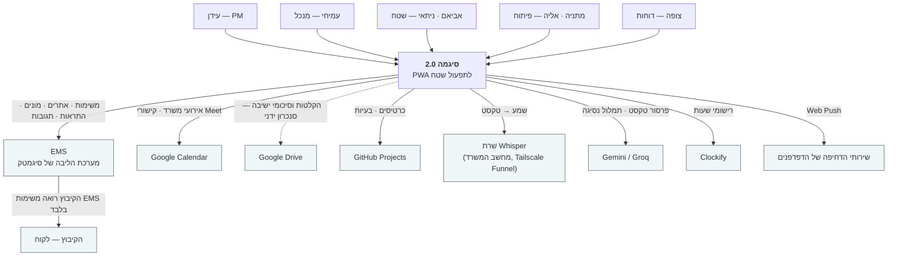

### 5.2 C4 — מכולות

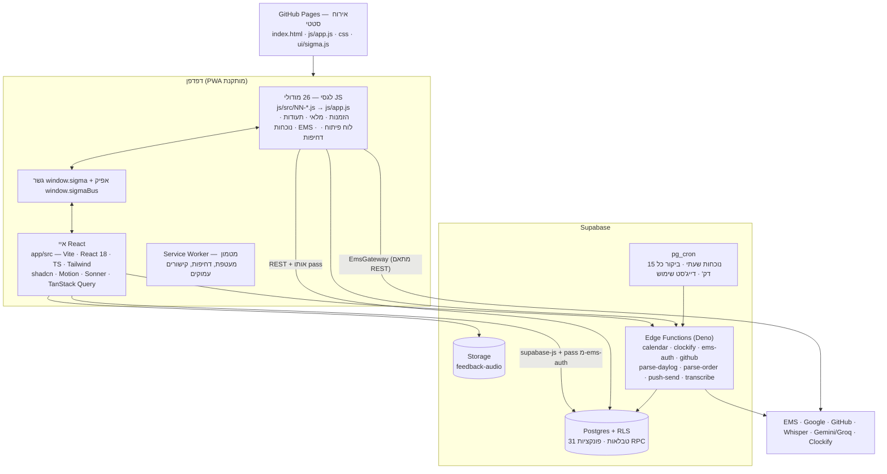

**עקרון מנחה (§7c):** האפליקציה הקיימת היא 13 אלף שורות של JS ואניל. שכתוב מלא נדחה. **משטחים חדשים נבנים
ב-React כאיים** (islands) בתוך העמוד הקיים, והלגסי ממשיך לרוץ ונגיש רק דרך גשר מוטיפס. זו ההחלטה
הארכיטקטונית המרכזית של השחרור, והיא מה שאיפשר לשלב את כל הפיצ'רים האלה בלי הקפאת מוצר.

### 5.3 חוזה הגשר ואפיק האירועים

- **`window.sigma`** — 82 פונקציות מוטיפסות, מוגדרות ב-`js/src/00-bridge.js` (ראשון בסדר השרשור) ונפתרות
  בעצלתיים כדי שסדר הטעינה לא ישנה. React אינו נוגע בשום גלובל אחר. דוגמאות מייצגות:
  `getCurrentUser · getRole · isViewer · isIdan · isAdmin · canUseEms · canSeeAttendance · canShowPage ·
  ems (השער) · emsWrite · emsApi · emsCacheData · emsSiteIdForKibbutz · emsSync · createTask · emsAddComment ·
  openVisitQuick · saveVisitFromData · certFromVisitForm · certFromVisit · getLastVisit · visitDraftFor ·
  openKibbutzModal · openKibbutzEmsTask · decorateCards · showPage · toast · track · beginReLogin · ensurePass`.
- **`window.sigmaBus`** — 20 אירועים מוצהרים באיחוד טיפוסים; שם מחוץ לאיחוד הוא שגיאת כתיב, לא פיצ'ר.
  המפה המלאה (מקור → אירוע → צרכנים עם קובץ:שורה) נוצרת אוטומטית ל-`docs/integration-map.md` בכל בנייה.

| אירוע | מופק על ידי | נצרך על ידי (דוגמה) |
|---|---|---|
| `user-changed` | התחברות, החלפת משתמש, ריפוי זהות | ניווט, נוכחות, שטח, שימוש, עמוד נוכחי |
| `ems-cache-synced` | סנכרון מטמון ה-EMS | כרטיסים, יומן, שטח, בית, מצב ישיבה |
| `ems-queue-flushed` | שחרור תור הכתיבה | בולטי ישיבה (פתרון ➕ ממתין) |
| `visit-saved` | שמירת ביקור | נוכחות, יומן, שטח, טיוטות, מצב ישיבה |
| `visit-draft-changed` / `visit-form-open` | טופס הביקור | צ'יפ טיוטה, פעולות הכרטיס, בריפינג |
| `notes-changed` · `kibbutzim-published` · `internal-tasks-changed` · `onboarding-changed` · `burns-changed` · `feedback-changed` · `dayplan-changed` · `attendance-saved` · `holidays-loaded` · `work-session-saved` | המשטח שכתב | המשטח שצריך להתרענן |
| `session-expired` | מנקז ה-401 | גיליון ההתחברות מחדש |
| `theme-changed` | מנגנון ערכת הנושא | מתג התצוגה, טוסטים |
| `checkin-created` · `work-session-saved` | שטח · טיימר | **ללא צרכן** — אירועי הכרזה מכוונים, מתועדים במפה (הכרעה 19.9) |

**כלל אינטגרציה מחייב:** כל פונקציית גשר, אירוע, טבלה, מצב דחיפה, אי או עמוד חדשים נוספים ל-
`docs/integration-map.md` ול-`test-integration.mjs` **באותו commit**. הבדיקה מחזיקה היום **123 חוזים**, והיא רצה
כחלק מ-`npm test`. פיצ'ר שמשנה נתון משותף חייב להפיק את האירוע שלו — שום עמוד לא יציג נתון מיושן
שעמוד אחר זה עתה שינה.

### 5.4 שער ה-EMS (מוכן ל-MCP)

`EmsGateway` (`app/src/lib/ems/gateway.ts`) חושף 13 פעולות מוטיפסות המחזירות טיפוסים של האפליקציה ולא JSON גולמי:
`listOpenTasks · getTask · createTask · updateTask · addComment · listSites · listMeters · listAlerts ·
energyBalance · billingSummary · listUsers · login/verifyOtp · capabilities`. המתאם `ems-rest` הוא **המקום היחיד**
שבו נבנית כתובת EMS או נקרא JSON גולמי; כשה-EMS יחשוף MCP נוסף מתאם `ems-mcp`, אותם goldens ירוצו, והדגל
מתהפך פעולה-פעולה. `capabilities()` מזין את נראות הכפתורים — פעולה שאינה נתמכת אינה מרנדרת כפתור.
אחת-עשרה יחידות לגסי ופונקציות Deno עדיין קוראות ישירות; כל אחת מופיעה במפה **עם נימוק** (הן ה-transport עצמו,
תור הלא-מקוון, פעולות ההתחברות, או בדיקות תקפות בצד השרת), והסריקה נכשלת על כל קריאה ישירה חדשה.

### 5.5 מודל הנתונים — ERD

```mermaid
erDiagram
  kibbutzim ||--o{ kibbutz_meeting_notes : "בולטים"
  kibbutzim ||--o{ visits : "ביקורים"
  kibbutzim ||--o{ field_checkins : "צ'ק-אין"
  kibbutzim ||--o{ visit_drafts : "טיוטות"
  kibbutzim ||--o{ internal_tasks : "משימות פנימיות"
  kibbutzim ||--o{ onboarding_steps : "צעדי קליטה"
  kibbutzim ||--o| kibbutz_health : "בריאות"
  kibbutzim ||--o{ work_sessions : "שעות"
  kibbutzim ||--o{ site_contacts : "אנשי קשר"
  kibbutzim ||--o| kibbutz_details : "פרטי חיוב"
  kibbutzim ||--o{ delivery_certs : "תעודות"
  kibbutzim ||--o{ meter_burns : "צריבות"
  kibbutzim ||--o{ kibbutzim : "תת-אתר (parent)"
  visits ||--o{ delivery_certs : "ref_id"
  visits ||--o{ movements : "אספקה בביקור"
  visits ||--o{ returns : "החזרות"
  orders ||--o{ movements : "אספקה וקבלה"
  requirements ||--o| orders : "linked_order_id"
  products ||--o{ movements : "מוצר"
  meeting_sessions ||--o{ meeting_events : "אירועי ניווט"
  onboarding_templates ||--o{ onboarding_steps : "תבנית"
  generators ||--o{ meter_burns : "גנרטור"
  push_subscriptions ||--o{ push_log : "מכשיר"
  user_settings ||--o| attendance : "שעת סוף יום"
  company_holidays ||--o{ attendance : "חג אינו חסר"
  calendar_absences ||--o{ attendance : "apply_absence"
  day_plans ||--o{ field_checkins : "סדר המסלול"
  feedback ||--o| transcribe_log : "תמלול"
  tasks ||--o| kibbutzim : "מקור הזריעה (לגסי)"
```

**אינוונטר הטבלאות המלא (31 טבלאות + דלי אחסון אחד) — כל קובץ `db/*.sql` מיוצג:**

| # | טבלה | קובץ המיגרציה | בעלים תפעולי | שדות עיקריים | הערות |
|---|---|---|---|---|---|
| 1 | `kibbutzim` | `kibbutzim.sql` (+`kibbutzim_ems_params.sql`, זרעים) | עידן · עמיחי | name · display_name · section · energy[] · marketing · region · kind · parent · ems_site_ids[] · ems_params · archived_at | ישות הליבה; ארכוב ולא מחיקה |
| 2 | `kibbutz_meeting_notes` | `kibbutz_meeting_notes.sql` (+`_import`, `_source`) | עידן | kibbutz · meeting_date · meeting_kind · seq · text · owners[] · ems_task_id · done_at · source · text_changed_at | מפתח ייחודי (קיבוץ, תאריך, סוג, seq) |
| 3 | `visits` | `supabase_schema.sql` (+`visits_open_items`, `visits_ems_task_id`) | שטח | id · kibbutz · date · visitor · duration · workday · products · summary · open_items · ems_task_id | סיכום הביקור |
| 4 | `visit_drafts` | `visit_drafts.sql` | שטח | id (= מזהה הביקור המוקדם) · person · kibbutz · date · payload | נמחקת בשמירה; פגה ב-14 יום |
| 5 | `field_checkins` | `field_checkins.sql` | שטח | person · kibbutz · checked_in_at · reminded_at · dismissed | מניע את תזכורת השעתיים |
| 6 | `day_plans` | `day_plans.sql` | שטח · עידן | person · date · stops (jsonb) | מסלול היום; מפתח (אדם, תאריך) |
| 7 | `calendar_absences` | `calendar_absences.sql` | עידן · עמיחי | person · kind · start_date · end_date · note · required | מייצרת שורות נוכחות דרך `apply_absence` |
| 8 | `company_holidays` | `company_holidays.sql` (+ זרע) | עידן · עמיחי | date · name · kind · required | מקור אמת אחד ללקוח ולשרת |
| 9 | `attendance` | `supabase_schema.sql` (+`source`) | שטח | id · date · person · day_type · note · source | append-only |
| 10 | `user_settings` | `user_settings.sql` | המשתמש | person · landing · card_desc · font · theme · eod_hour | שורה לכל אדם |
| 11 | `internal_tasks` | `internal_tasks.sql` | כל העובדים | title · owner · kibbutz (null = חברה) · done | ללא תאריכי יעד — הכרעה |
| 12 | `onboarding_templates` | `onboarding_templates.sql` | עידן | name · steps (jsonb) | תבנית תשעת הצעדים |
| 13 | `onboarding_steps` | `onboarding_steps.sql` | עידן | kibbutz · step_key · label · seq · state · waits · sent_at · done_at | ייחודי (קיבוץ, צעד) |
| 14 | `kibbutz_health` | `kibbutz_health.sql` | עמיחי | kibbutz · score · signals (jsonb) · computed_at | **טיוטה** — ללא cron עד שהספים ייקבעו |
| 15 | `work_sessions` | `work_sessions.sql` | עידן · מתניה | person · kibbutz · kind · attendees[] · tags[] · started_at · ended_at · billable · clockify_id | נכתבת גם כשהשירות החיצוני נכשל |
| 16 | `meeting_sessions` | `meeting_sessions.sql` | עידן | date · kind · started_at · ended_at · host · calendar_event_id | 🟡 לא הוחלה |
| 17 | `meeting_events` | `meeting_events.sql` | עידן | session_id · t_sec · kind · kibbutz · issue_number · hint | 🟡 לא הוחלה |
| 18 | `feedback` | `feedback.sql` (+`feedback_kinds.sql`) | עידן · עמיחי | author (null = אנונימי) · kind · text · audio_path · status · github_issue | שני סוגים בלבד |
| 19 | `app_admins` | `feedback.sql` | — | name | רשימת מנהלים לצד השרת |
| 20 | `transcribe_log` | `feedback.sql` | — | engine · ms · ok · audio_sec · error | אין תמליל |
| 21 | `usage_events` | `usage_events.sql` | עידן | person · page · action · target · at · session_id · device | ללא מידע אישי |
| 22 | `daylog_corrections` | `daylog_corrections.sql` | — | person · raw_len · json_before · json_after | דוגמאות few-shot בלבד |
| 23 | `parse_corrections` | `parse_corrections.sql` | — | raw_text · items | פרסור הזמנות (קיים) |
| 24 | `delivery_certs` (+`kibbutz_details`) | `delivery_certs*.sql` (5 קבצים) | שטח · צופה | cert_number · kibbutz · customer · items · recipient · signature · status · replaced_by · drive_url | ביטול והחלפה, לא מחיקה |
| 25 | `site_contacts` | `site_contacts.sql` | עידן | kibbutz · name · role · email · phone · active | מזין נוכחים ושרשרת EMS |
| 26 | `push_subscriptions` | `push_subscriptions.sql` | — | endpoint · owner · keys · user_agent | מכשירים |
| 27 | `push_log` | `push_log.sql` | — | sent_at · event · recipient · title · body · status · error | תקרות ואידמפוטנטיות |
| 28 | `dev_status_log` | `dev_status_log.sql` | פיתוח | issue · status · day | היסטוריית הלוח |
| 29 | `meter_burns` · `generators` | `meter_burns.sql` (+ זרע) | אביאם · ניתאי | meter_id · serial · site · meter_type · status · burned_by · generator_id | פרויקט זמני |
| 30 | לגסי מ-`supabase_schema.sql` | `supabase_schema.sql` | — | `tasks` (זריעת הקיבוצים והאיזורים) · `products` · `orders` · `movements` · `requirements` · `returns` · `settings` · `potentials` · `regions` · `ems_cache` · `ems_queue` | `movements` = ספר מוסיף-בלבד; `ems_cache` = שורה יחידה משותפת |
| 31 | `auth_attempts` | נוצרת ומנוהלת על ידי `ems-auth` | — | ניסיונות כניסת צופה | RLS פעיל **ללא מדיניות** — אף תפקיד לקוח אינו קורא או כותב |
| — | דלי `feedback-audio` | `feedback.sql` | — | הקלטות | פרטי; קריאה בקישור חתום למנהלים |

**קבצי SQL שאינם טבלאות:** `rls_staged.sql` · `rls_authenticated_only.sql` · `rls_corrections_lockdown.sql` ·
`rls_certs_checkins_lockdown.sql` (מדיניות) · `cron_visit_15min.sql` · `cron_usage_weekly.sql` (עבודות) ·
`kibbutz_meeting_notes_import.sql` (פונקציית ייבוא טרנזקציונית) · קבצי זריעה ותיקוני נתונים.

### 5.6 פונקציות קצה ואינוונטר סודות

| פונקציה | תפקיד | מצבים | סודות שהיא קוראת |
|---|---|---|---|
| `ems-auth` | מחליפה אסימון EMS ב-pass של 180 דקות; כניסת צופה | ברירת מחדל · `viewer` | `EMS_API_BASE` · `JWT_SECRET` · `EMS_BRIDGE_SECRET` · `VIEWER_PIN` · `SUPABASE_URL` · `SUPABASE_SERVICE_ROLE_KEY` |
| `push-send` | כל הדחיפות והדייג'סטים | `approveOrder` · `attendanceReminder` · `attendanceCron` · `visitCron` · `gapReminder` · `feedbackNew` · `usageDigest` (+`inventoryAlert`/`inventoryDigest` ב-2.01) | `VAPID_PUBLIC` · `VAPID_PRIVATE` · `VAPID_SUBJECT` · `CRON_SECRET` · `APP_ORIGIN` · `SUPABASE_*` |
| `transcribe` | שרשרת שרת הבית ואז Groq; בדיקת בריאות; סקר ליטוש | ברירת מחדל · `health` · לפי מזהה עבודה | `SELF_WHISPER_URL` · `SELF_WHISPER_TOKEN` · `GROQ_API_KEY` · `GROQ_FALLBACK` · `SUPABASE_*` |
| `parse-order` | פרסור הזמנה מטקסט | ברירת מחדל · תיקון | `GEMINI_API_KEY` · `GEMINI_MODEL` · `GROQ_API_KEY` · `GROQ_MODEL` |
| `parse-daylog` | פרסור יומן שטח | ברירת מחדל · `correction` | אותם סודות כמו `parse-order` |
| `calendar` | אירועי Google Calendar + קישורי Meet | ברירת מחדל | `GCAL_ID` · `GCAL_SA_EMAIL` · `GCAL_SA_KEY` |
| `github` | קריאת לוח הפיתוח, שינוי סטטוס ועדיפות, יצירת בעיה | ברירת מחדל · `setStatus` · `setPriority` · `createIssue` | `GH_TOKEN` · `GH_REPO` · `GH_PROJECT_OWNER` · `GH_PROJECT_NUMBER` |
| `clockify` | רשימת תגיות, פרויקטים, יצירת רישום | `tags` · `projects` · `entry` | `CLOCKIFY_API_KEY` · `CLOCKIFY_WORKSPACE_ID` · `CLOCKIFY_USER_ID` |

**כל הסודות (שמות בלבד — ערכים לעולם לא במאגר ולא במסמך):** `APP_ORIGIN` · `CLOCKIFY_API_KEY` ·
`CLOCKIFY_USER_ID` · `CLOCKIFY_WORKSPACE_ID` · `CRON_SECRET` · `EMS_API_BASE` · `EMS_BRIDGE_SECRET` · `GCAL_ID` ·
`GCAL_SA_EMAIL` · `GCAL_SA_KEY` · `GEMINI_API_KEY` · `GEMINI_MODEL` · `GH_PROJECT_NUMBER` · `GH_PROJECT_OWNER` ·
`GH_REPO` · `GH_TOKEN` · `GROQ_API_KEY` · `GROQ_FALLBACK` · `GROQ_MODEL` · `JWT_SECRET` · `SELF_WHISPER_TOKEN` ·
`SELF_WHISPER_URL` · `SUPABASE_SERVICE_ROLE_KEY` · `SUPABASE_URL` · `VAPID_PRIVATE` · `VAPID_PUBLIC` ·
`VAPID_SUBJECT` · `VIEWER_PIN`.
**פומביים במכוון ומתועדים ברשימת ההיתר של Gitleaks:** מפתח ה-anon של Supabase והמפתח הציבורי של הדחיפות.
**ממתינים להגדרה ידנית של עידן:** `VIEWER_PIN` · `CRON_SECRET` · `CLOCKIFY_API_KEY` · `CLOCKIFY_WORKSPACE_ID`.

### 5.7 בנייה, פריסה וסביבות

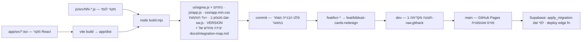

- **סביבות:** פרויקט Supabase אחד (ייצור). תצוגה מקדימה היא `dev` דרך raw.githack מול אותו מסד. אין סביבת
  Staging נפרדת — **זה סיכון מוצהר (R-6)**. `?sb=0` מפעיל נתונים מדומים בלקוח, `?login=0` עוקף את שער
  ההתחברות ומושבת במקור הייצור.
- **מיגרציות** מופעלות בשמן (`apply_migration`), לעולם לא כ-SQL אד-הוק. פונקציות קצה נפרסות ידנית לאחר
  השוואה מול `origin/main`, ומקבלות מספר גרסה.
- **עבודה מקבילית:** כמה סשנים עובדים על אותו מאגר; `origin` הוא מקור האמת היחיד, דחיפה ל-`main` היא
  קידום-מהיר בלבד אחרי rebase ובנייה מחדש, ו-`--force` אסור.

---

## 6 | זרימות נתונים, מצבי כשל ונסיגה

### 6.1 עקרונות הנסיגה
1. **כל כשל חיצוני הוא מצב מתוכנן, לא חריגה.** לכל שילוב חוץ יש מסלול שני או תור.
2. **מה שהמשתמש הקליד לא הולך לאיבוד** — טיוטה, שורת שעות, פריט בתור.
3. **לעולם לא לשנות רשומה שמורה מאחורי גבו של המשתמש** (כלל הליטוש בתמלול).
4. **הודעת הכשל מדברת על המצב שלו, לא על המנגנון שלנו** (כלל הניסוח §7h).

### 6.2 התמלול

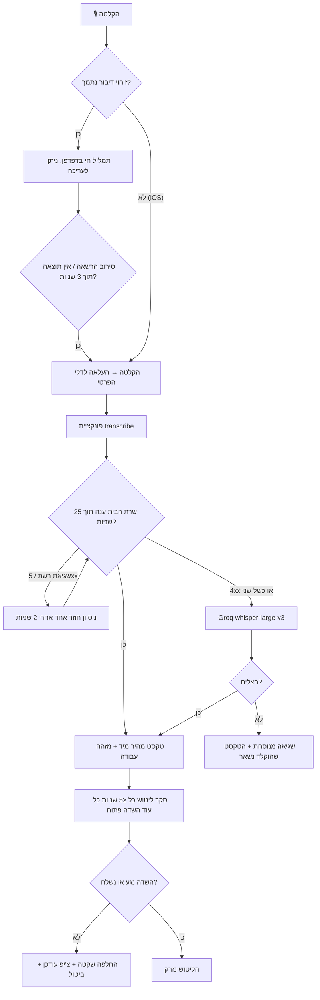
**כשלים נוספים:** השרת מתאתחל (10–60 שניות) → נסיגה ל-Groq · `SELF_WHISPER_TOKEN` לא מוגדר בסביבה → נסיגה
שקטה ל-Groq, לא שגיאה · שמע מעל 25MB → נדחה בקצה · `GROQ_FALLBACK=off` → הכשל מוחזר במפורש.

### 6.3 תזכורת הביקור וזרימת הדחיפות

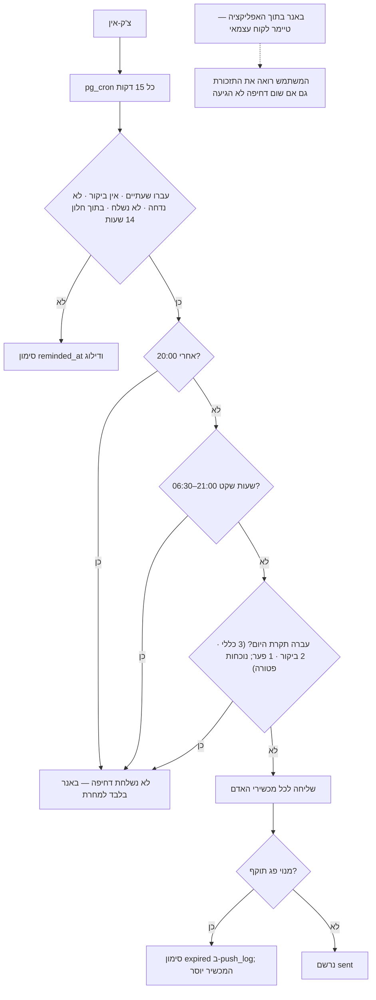

### 6.4 כתיבה ל-EMS כשאין רשת

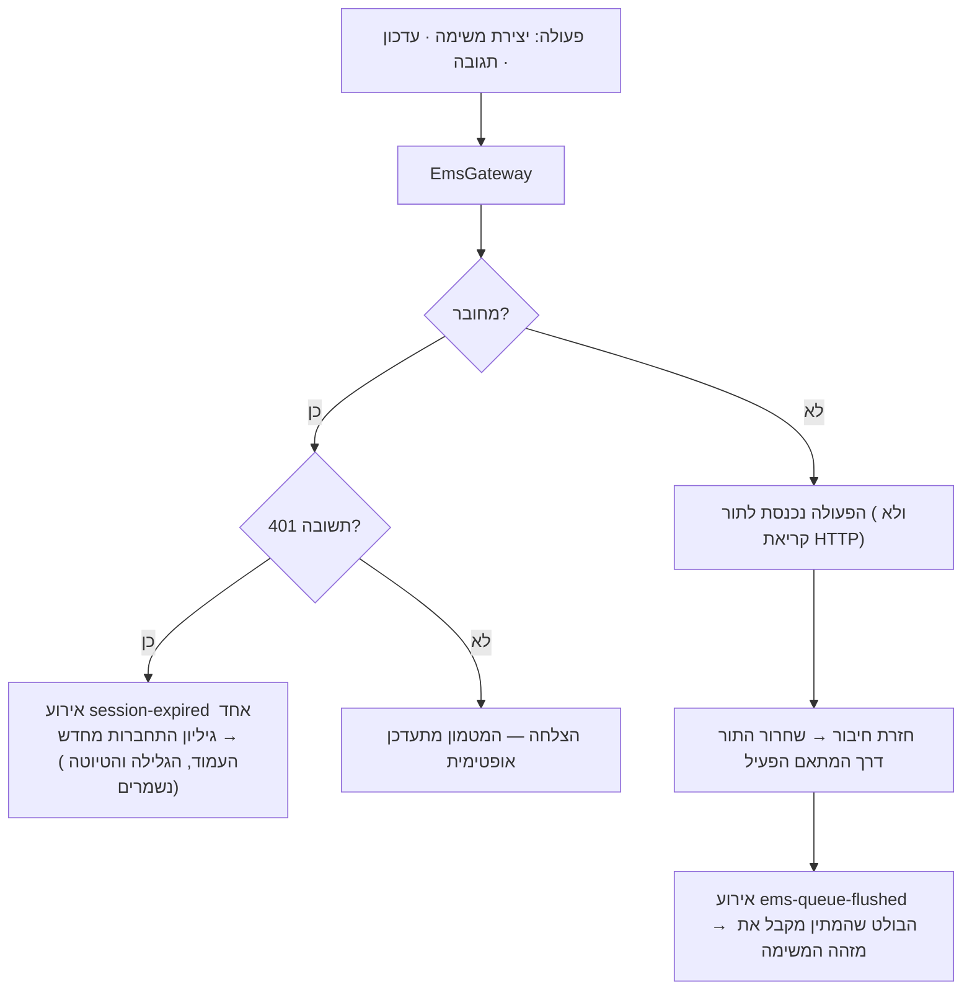

### 6.5 שמירת ביקור

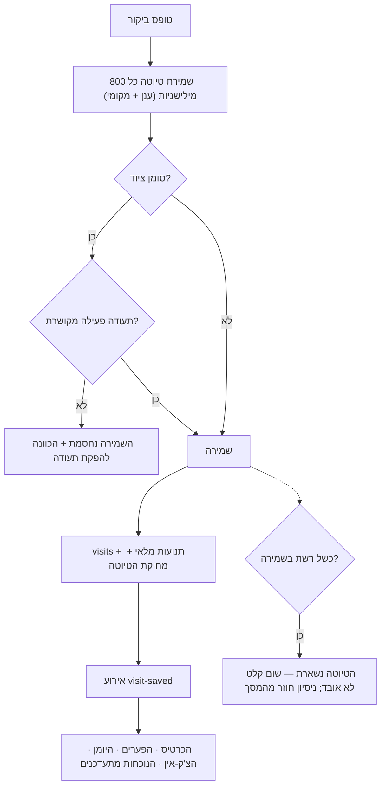

### 6.6 טבלת מצבי כשל מרוכזת

| תלות | כשל | מה המשתמש רואה | נסיגה |
|---|---|---|---|
| דחיפות (Web Push) | לא נמסרה / אין הרשאה | באנר בראש מסך הבית + סימון בפערים | טיימר לקוח, בלתי תלוי |
| שרת Whisper | מושבת / מתאתחל / אין אסימון | "מתמלל…" ואז טקסט | Groq, ואז עריכה ידנית |
| Gemini | מכסה / שגיאה | הפרסור לוקח רגע נוסף | Groq, ואז היוריסטיקה מקומית, ואז הקלדה |
| EMS | לא מקוון / 401 / אין רענון אסימון | גיליון התחברות מחדש יחיד | תור פעולות + מטמון משותף לקריאה |
| Supabase | 401 / PGRST301 | אותו גיליון בדיוק | מטמון נשמר לצביעה ראשונה |
| Clockify | כשל API | "נשמר" | שורת שעות מקומית בלי מזהה חיצוני |
| GitHub | אסימון בלי הרשאות | הפעולה נכשלת במפורש | הדיווח נשאר בתיבה |
| Google Calendar | פונקציה לא פרוסה / שגיאה | היומן מציג ביקורים ומשימות בלבד | שכבות עצמאיות |
| GitHub Pages | נפילת אירוח | האפליקציה לא נטענת | מעטפת ב-Service Worker למכשיר שכבר פתח |
| מטמון EMS מיושן | עבודת המשרד לא רצה | נתון ישן, מתרענן ברקע | סנכרון מכל מכשיר + משיכה לרענון |

---

## 7 | סיכונים, הכרעות פתוחות ושחרור מדורג

### 7.1 סיכונים ומיטיגציה

| # | סיכון | השפעה | מיטיגציה |
|---|---|---|---|
| R-1 | **אימוץ** — שבירת הרגלים של דיווח היא הקושי האמיתי, לא הטכנולוגיה | הנתונים נשארים חלקיים והדוחות לא אמינים | זרימה קצרה (טופס בשתי הקשות), נדנוד חיובי בלבד, תקרות דחיפה, פיילוט שבועיים עם מדידה דרך אירועי השימוש, דייג'סט מנוסח כמשפטים ולא כמספרים |
| R-2 | **תלות ב-EMS** ללא אסימון שירות וללא רענון — הסשן נשען בכניסה חוזרת ידנית | עבודות רקע אינן יכולות לגשת ל-EMS בשם החברה | נמדד ותועד; נפתח כרטיס בלוח הפיתוח ל-TTL ≥ 8 שעות; בינתיים מטמון משותף + עבודת מחשב המשרד |
| R-3 | **האימות הדו-שלבי של חשבון עידן ב-EMS** עלול לחסום לגמרי את עבודת הרענון | המטמון מתיישן כשאיש אינו באפליקציה | העבודה יוצאת בקוד 3 עם הסבר; שתי דרכי המשך מתועדות ב-runbook |
| R-4 | **אין אסימון = אין אימות חי** לכמה מסלולים (שרשרת Gemini/Groq, סבב שמע ב-Groq, יצירת בעיה ב-GitHub, רענון המטמון) | תקלה שתתגלה רק אצל משתמש | כל אחד מסומן במפורש כ"לא נבדק חי" ומופיע ברשימת העשן של עידן |
| R-5 | **עשרים פעולות ייצור ממתינות** (מיגרציות ופריסות) שנחסמו בסיווג ההרשאות | פיצ'רים שנבנו מתנוונים בשקט (יומן בלי מסלול, ישיבה בלי תיעוד) | רשימה מרוכזת ב-7.3, בקשת אישור אחת מרוכזת או הרצה מתוך עורך ה-SQL |
| R-6 | **אין סביבת Staging** — התצוגה המקדימה עובדת מול מסד הייצור | ניסוי יכול לגעת בנתוני אמת | מצב מדומה `?sb=0` לבדיקות, Playwright רץ מול שרת מקומי, מיגרציות מופעלות בשמן |
| R-7 | **מורכבות המיזוג בין לגסי ל-React** — מיזוג ענף אחד ייצר קוד תקין למראה ושגוי בשלושה מקומות | תקלות שקטות | כל מיזוג נסקר בנפרד; במקרה שאירע נסרקו כל 17 הקבצים ונמצאו ותוקנו שלושה, והסוקר חיפש רביעי ולא מצא |
| R-8 | **ספים של מדד הבריאות הם מספרי טיוטה** | החלטה ניהולית על נתון שאינו אמת | כל הספים בקובץ תצורה אחד עם דגל `draft`, סימון "טיוטה" בממשק, ערך חסר מוחרג ולא נספר כאפס |
| R-9 | **ZAP מדולג** (אין Docker במחשב הבנייה) | שכבת סריקה פסיבית חסרה לפני שחרור | חמשת השערים האחרים ירוקים; התקנת Docker היא פריט העברה לעידן |
| R-10 | **הצעת הסיווג בסקירת הישיבה גסה** — 91 מתוך 124 משפטים בסיכום 17.9 הוצעו כמשימת EMS | עידן יילחם בממשק במקום להיעזר בו | הוא עורך בהקשה אחת; הכוונון ייעשה אחרי שימוש אמיתי ראשון |
| R-11 | **מקור עמודת "עלתה גרסה" בלוח הפיתוח מוסק** (העמודה שעליה נשען הקוד הוסרה מהלוח ב-8.9) | הזזת כרטיסים לעמודה הלא נכונה | אישור מציג את שם עמודת המקור לפני כל כתיבה — הנחה שגויה גלויה; דורש מילה מעידן (O-4) |

### 7.2 הכרעות פתוחות

| # | שאלה | מקור | ברירת מחדל / המלצה | חוסם? |
|---|---|---|---|---|
| O-1 | **ספי מדד הבריאות ומקור הנתונים** (היכן ה-EMS חושף רווח/הפסד ומאזן אנרגיה — API או קריאה למסד) | תהליך חברה §5, §9 | תזכורת קבועה ל**שלישי 22.9 09:00**; עד אז הספים טיוטה וסימון "טיוטה" גלוי | לא — הצורה נבנתה |
| O-2 | **"עלתה גרסה" בלוח הפיתוח** — מקור העמודה מוסק | T11 | להשאיר את ההסקה עם אישור מפורש; שינוי הוא שורה אחת | לא |
| O-3 | **מיקום המלאי בשמירה מיומן השטח** — האפיון אמר "חברה", מיקום שעדיין אינו קיים | T16 | נעשה שימוש בברירת המחדל של הטופס; מאגר "חברה" הוא שינוי נתונים במסגרת 2.01 | לא |
| O-4 | **מי רשאי לסגור משימה של אדם אחר** מתוך יומן השטח (תיבת שינוי סטטוס) | T16, §7i | נדחה — תגובות בלבד עד הכרעה | לא |
| O-5 | **האם הנוכחים ברישום השעות יהיו גם תגיות** — כ-40 מתוך 87 התגיות ב-workspace הן שמות אנשים | T29 | להשאיר נוכחים ותגיות נפרדים עד שעידן יכריע | לא |
| O-6 | **הרשאות EMS לעבודת מחשב המשרד** ומה עושים אם יש אימות דו-שלבי | T20 | לא נמסרו, לא חופשו ולא נשמרו; העבודה בדוקה בהרצה יבשה בלבד | כן לפיצ'ר הזה |
| O-7 | **קליטת מיילים מ-Gmail** — עידן לא אישר | תהליך חברה §3b, §8b | לא בהיקף; מפת החשיפה נשמרה ל-4.5 כדי שהאישור לא ידרוש אפיון מחדש | לא |
| O-8 | **ייבוא אוטומטי של סיכומי ישיבה מ-Drive** | תהליך חברה §9 | היום העלאה/הדבקה; ייבוא אוטומטי מאוחר יותר, כולל שיתוף התיקיות עם חשבון שירות | לא |
| O-9 | **מיגרציית המלאי לאיחוד המאגר** — מי מריץ ומתי (I1) | מלאי §8 | עידן מריץ אחרי עשן השחרור; ההרצה היבשה מוצגת לו קודם | 2.01 |
| O-10 | **האם דייג'סט המלאי גם לעידן (I2), ספי מלאי נמוך (I3), שמות לדוחות בתעודת הצופה (I4)** | מלאי §8 | עמיחי בלבד · ללא ספים עד שימולאו · שמות לדוחות במסלול הצופה | 2.01 |
| O-11 | **תיאור מקוצר או מלא בכרטיס בטלפון** — התקבל עם תקופת ניסיון | §7k #2 | תזכורת ל-9.10.26 לשאול את עידן; בינתיים מקוצר בטלפון + הגדרה אישית | לא |
| O-12 | **שלושה פערי מוצר מהביקורת של פרישת העמודים** (G5 דוח של אדם אחר בדואר, G6 הודעה לעובד, G8 גרפי ניתוח ביקורים) | §7m | G5 נסגר — אין שליחת דואר; G6 הוחלף במשימה פנימית; G8 יתקפל למסך הסקירה | לא |
| O-13 | **שם האפליקציה** — סיגמה (ברירת מחדל) מול החלופות שהוצעו | §6 | "סיגמה · תפעול שטח" בשימוש בפועל | לא |

### 7.3 עשרים פעולות הייצור הממתינות (חסומות בסיווג הרשאות, דורשות אישור עידן)

**סדר חשוב במסומנים.** רשימה זו היא הפער היחיד בין "נבנה ונסקר" לבין "עובד בייצור".

| # | פעולה | מה שבור עד שתבוצע |
|---|---|---|
| 1–2 | `db/day_plans.sql` · `db/calendar_absences.sql` | מסלול היום והיעדרויות ללא טבלה — היומן מתדרדר לתצוגה בסיסית |
| 3 | פריסת פונקציית `calendar` | אין טווח תאריכים ואין קישורי Meet |
| 4 | `db/internal_tasks.sql` | משימות החברה מרונדרות מהשורה הישנה; שום נתון לא אובד |
| 5 | פריסת `push-send` (שעת סוף יום לכל אדם + מצב תזכורת פערים) | נדנוד ב-19:00 לכולם; כפתור ה-🔔 בפערים מחזיר שגיאה |
| 6–7 | פריסת `parse-daylog` · `db/daylog_corrections.sql` | יומן השטח אינו מפרסר |
| 8–10 | `db/meeting_sessions.sql` → `db/meeting_events.sql` → `db/kibbutz_meeting_notes_source.sql` (**בסדר הזה**) | מצב הישיבה מנווט אך אינו מתעד; צ'יפים שאינם EMS נכשלים |
| 11–12 | `db/onboarding_templates.sql` · `db/onboarding_steps.sql` | אין רצועת קליטה |
| 13 | `db/kibbutz_health.sql` | אין שמירת בריאות |
| 14–15 | `db/work_sessions.sql` · פריסת `clockify` (+ שני הסודות) | אין מדידת שעות |
| 16–18 | פריסת `parse-daylog` ו-`parse-order` **ואז** `db/rls_corrections_lockdown.sql` · פריסת `github` (תגובות בקריאה) | המיגרציה לבדה משתיקה את לולאת הלמידה |
| 19 | `db/rls_certs_checkins_lockdown.sql` — **רק אחרי ש-2.00 חי** | הרצה מוקדמת תשבור כל קישור תעודה משותף |
| 20 | הרצה חוזרת של `db/kibbutz_meeting_notes_import.sql` | ייבוא חוזר לקיבוץ ששינה שם מאבד קישור |
| + | סודות: `VIEWER_PIN` (כניסת הצופה סגורה בלעדיו) · `CRON_SECRET` · שני סודות Clockify | — |
| + | תזמון עבודות ה-cron: ביקור כל 15 דקות · דייג'סט שימוש שבועי · תזמון מחדש של הנוכחות עם הכותרת | התזכורות אינן רצות |
| + | התקנת Docker לשער ZAP | שער אבטחה אחד מדולג |

### 7.4 שחרור מדורג

| גרסה | תוכן | מצב |
|---|---|---|
| **2.00** | כרטיסים מבוססי-נתונים · בולטי ישיבה · משימות EMS מלאות · זרימת שטח ותזכורת · טיוטות · יומן מאוחד עם מסלול ושלוש תצוגות · נוכחות וחגים · פערים והגדרות · תיבת רעיונות ותמלול · יומן שטח AI · אנליטיקה · מצב ישיבה וסקירה · משימות פנימיות · קליטה · בריאות (טיוטה) · שעות · לוח פיתוח · צריבות · הקשחת סשן · שער EMS · שערי איכות · פרישת ארבעה עמודים | כל המשימות 0–6b, 11–18b, 20–30 **הושלמו ונסקרו**. נותרו משימת השחרור (T7) ועשרים פעולות הייצור |
| **2.01** | מלאי אחוד: מאגר חברה · שני שמות למוצר · דיווח שינוי מקושר · התראות ודייג'סט 12:00/17:00 | מתוכנן (T8–T10), אפיון מאושר, לא נבנה |
| **2.02** | מתאם `ems-mcp` כשה-EMS יחשוף MCP · ייבוא אוטומטי מ-Drive · קליטת מיילים (אם תאושר) · גרפים במסך הסקירה · מדד בריאות עם ספים אמיתיים | מסומן, לא מתוכנן |

**מה שכבר חי בייצור היום:** שערי האיכות ומצב התחזוקה, הקשחת הסשן (`ems-auth` v18), `push-send` v13,
`transcribe` v3, `github` v18, טבלאות הקיבוצים, הבולטים, הצ'ק-אינים, החגים, ההגדרות, טיוטות הביקור,
אנליטיקת השימוש, הצריבות, ונעילת הכתיבה האנונימית על `ems_cache`.

---

## 8 | מטריצת עקיבות — בקשה → אפיון → משימה → בדיקה

| # | מה עידן ביקש (מילולית) | אפיון | דרישות | משימה | הבדיקה |
|---|---|---|---|---|---|
| 1 | לא עוד "אחראים" ולא סטטוס חופשי בכרטיס | §2 | FR-04 | T1 | סריקת מחרוזות + `test-kibbutzim.mjs` |
| 2 | משפטי הישיבה הופכים לבולטים מצטברים על הקיבוץ | §3 | FR-11, FR-15 | T2 | goldens על שלושת הסיכומים |
| 3 | לפתוח משימת EMS מכל בולט בהקשה | §3.3 | FR-14 | T2 | `titleFromBullet` + פתרון התור |
| 4 | משימות EMS מוצגות במלואן | §4 | FR-17, FR-18 | T3 | render goldens + mapper |
| 5 | שינוי שמות המדורים | §2 | FR-02 | T1 | golden + בדיקת תוויות |
| 6 | הסרת עדיפות עליונה, פס התקדמות ותצוגה מצומצמת | §2 | FR-04 | T1 | contract sweep |
| 7 | רענון חזותי מהיר, ידידותי לאגודל, מלא-רוחב בשולחן | §6 | NFR-05–09 | T4, T22b | Lighthouse + התאמה חזותית |
| 8 | זרימת הגעה לשטח + תזכורת אחרי שעתיים | §5 | FR-20, FR-25–28 | T5 | `visitCronSelect` + Playwright |
| 9 | תיבת תלונות ורעיונות עם הקלטה | §7 | FR-48–54 | T6, T6b | matrix + goldens לשרשרת |
| 10 | להקים קיבוצים מתוך האפליקציה | §7b | FR-06, FR-07 | T1b | `validateKibbutz` + `emsChainReduce` |
| 11 | סוגי אנרגיה לעריכה של עידן בלבד | §7b | FR-08 | T1b | `kibbutzimSaveBody` matrix |
| 12 | קיבוץ לפי איזור, א״ב בתוך איזור, עדין | §7b | FR-03 | T1 | golden סידור |
| 13 | הצופה מקבל את העיצוב החדש עם כל הפונקציות | §6 | FR-49, NFR-27 | T4 | `test-viewer-gate.mjs` ללא שינוי |
| 14 | שני מדורים: חדשים ופעילים; שיווקי הוא תג | §2 | FR-02 | T1 | golden |
| 15 | ➕ בשני מצבים: קיבוץ חדש או תת-אתר, עם אימות מול EMS | §7b | FR-06, FR-07 | T1b | goldens לשרשרת |
| 16 | הזרימה, הפרוצדורה והצינור — למחוק, לא להסתיר | §2 | FR-04 | T1, T18a | contract sweep |
| 17 | שום דבר בלי התחברות EMS, התחברות מחדש אחת, סשן ≥ 3 שעות | §7n | FR-00, FR-81, FR-82 | T21 | gate matrix + 401 אמיתי |
| 18 | גישה ל-EMS מאחורי שער אחד, מוכן ל-MCP | §7o | FR-83, FR-84 | T18b | 27 goldens + סריקת חוזה |
| 19 | לוודא שיש קשר בין כל דף ופיצ'ר בקוד | §7m, T18 | כל המודולים | T18a | 123 חוזים ב-`test-integration.mjs` |
| 20 | להמליץ מה מיותר וכפול | §7m | FR-38, FR-39 | T14 | סריקת עמודים פרושים + ביקורת כיסוי |
| 21 | יומן אחד עם שכבות, מסלול יום ושיבוץ | §7f | FR-31–FR-37 | T13 | goldens ליומן |
| 22 | נוכחות צפופה בטלפון + חגים שאינם חסרים | §7e | FR-40–FR-43 | T12 | פיקסצ'ר ספטמבר 2026 |
| 23 | הגדרות אישיות ואזור אישי עם הפערים שלי | §7h | FR-44–FR-47 | T15 | `gapsFor` goldens |
| 24 | לכתוב/להכתיב את היום וה-AI יפצל לסיכומי ביקור | §7i | FR-55–FR-59 | T16 | 22 goldens + `test-daylog.mjs` |
| 25 | לדעת מי משתמש במה | §7j | FR-60–FR-62 | T17 | goldens לנרטיב |
| 26 | מצב ישיבה בלי להחליט תוך כדי + הערה חיה | תהליך §1.2, §1.2b | FR-63, FR-64 | T24 | 28 goldens + מפת מקשים |
| 27 | מסך הסקירה הוא עורך, לא מאשר | תהליך §1.3 | FR-65 | T25 | goldens + אי-שינויות |
| 28 | משימות פנימיות לכל העובדים, לא לקיבוץ, בלי תאריכי יעד | תהליך §2, §8b | FR-66 | T26 | sweep על שדות אסורים |
| 29 | צ'קליסט קליטה ללקוח חדש | תהליך §4 | FR-68 | T27 | goldens לתבנית |
| 30 | ארבעת אותות הבריאות של עמיחי | תהליך §5 | FR-69, FR-70 | T28 | goldens למנקדים |
| 31 | שעות ב-Clockify לכל קיבוץ, עידן ומתניה | תהליך §6, §8b | FR-71–FR-73 | T29 | goldens + סריקת סודות |
| 32 | ישיבת פיתוח והכנת ספרינט | תהליך §7 | FR-67 | T30 | goldens לדירוג |
| 33 | עמוד פיתוח: ארבע עמודות, רצועה, עץ | §7d | FR-78, FR-79 | T11 | goldens ללוח ולעץ |
| 34 | צריבות כפרויקט זמני בתוך 2.00 | T23 | FR-80 | T23 | goldens + דגל כיבוי |
| 35 | שערי איכות: סודות, סריקה, e2e, ביצועים, אבטחה | תוכנית מדורגת | NFR-06, NFR-17–19 | T22, T22b | `npm run qa` |
| 36 | מסך פתיחה לכל תפקיד | §7l | FR-44 | T4, T15 | matrix + Playwright |
| 37 | שום כפתור בלי תכלית, ו-➕ שיודע איפה הוא | §3.3, §7k.2 | FR-05 | T4 | `primaryAdd` matrix |
| 38 | שורת פקודה בשולחן העבודה | §7k.1 | FR-05 | T4 | Playwright לשורת הפקודה |
| 39 | כל מסך נצבע מיד מהמצב האחרון | §7k #10 | NFR-10–12 | T20 | goldens למדיניות המטמון |
| 40 | מסמך דרישות לסוקר חיצוני | T19 | המסמך הזה | T19 | נספח ב |

---

## 9 | מילון מונחים

| עברית / מונח | English | משמעות |
|---|---|---|
| EMS | Energy Management System | מערכת הליבה של סיגמטק; מקור האמת למשימות מול הלקוח |
| כרטיס קיבוץ | kibbutz card | יחידת התצוגה המרכזית: קיבוץ אחד וכל מה שפתוח בו |
| תת-אתר | sub-site | אתר משני של קיבוץ קיים, כרטיס לכל דבר |
| בולט ישיבה | meeting bullet | משפט מסיכום ישיבת החברה, משויך לקיבוץ ולבעלים |
| צ'ק-אין | check-in | סימון הגעה לקיבוץ, מפעיל את הבריפינג ואת תזכורת השעתיים |
| בריפינג | briefing | מסך ההגעה: משימות, בולטים, ביקור קודם, "לפני שיוצאים" |
| סיכום ביקור | visit summary | הרשומה שסוגרת את הביקור; מקור לחיוב, למלאי ולדוחות |
| תעודת משלוח | delivery cert | מסמך חתום למסירת ציוד; שער חובה כשסומן ציוד |
| פער | gap | חוב אישי נגזר: ביקור בלי סיכום, נוכחות חסרה, משימה באיחור |
| מסלול היום | day plan / route | סדר התחנות ליום, נשמר לאדם ולתאריך |
| משימה פנימית 🔒 | internal task | משימה שכל העובדים רואים והקיבוץ לעולם לא |
| מצב ישיבה | presenter mode | מסך מלא לניווט בישיבה, בלי החלטות תוך כדי |
| סקירה (ישיבה → סיכום) | review editor | עריכת משפטי הסיכום וסיווגם; כלום לא נכתב לפני "בצע" |
| אי (island) | React island | רכיב React המורכב לתוך העמוד הקיים |
| הגשר | bridge (`window.sigma`) | ממשק מוטיפס יחיד בין React ללגסי |
| האפיק | bus (`window.sigmaBus`) | אירועי הכרזה בין משטחים |
| שער ה-EMS | EmsGateway | הפשטת 13 הפעולות שמאפשרת החלפת REST ב-MCP |
| pass / הטבעה מחדש | bridge pass / re-mint | אסימון כתיבה ל-180 דקות שנטבע מאסימון ה-EMS |
| ליטוש | refine pass | מעבר תמלול שני ומדויק יותר, מחליף רק אם לא נגעו בשדה |
| בונה טהור | pure builder | פונקציה נטולת תופעות לוואי, נבדקת בפיקסצ'ר מוזהב |
| פיקסצ'ר מוזהב | golden fixture | קלט ריאלי + פלט צפוי קשיח |
| סריקת חוזה | contract sweep | קביעה תכנותית על כל הפלט, במקום בדיקה בעין |
| צריבה | meter burn | פעולת שטח על מונה; פרויקט זמני בן כמה חודשים |
| ספר התנועות | movements ledger | רישום מלאי מוסיף-בלבד |

---

## נספח א | צ'קליסט לסוקר — השאלות שהמסמך אמור לענות עליהן בישיבה אחת

**היתכנות**
1. האם כל פיצ'ר נשען על יכולת שכבר הוכחה בקוד, או שיש בו הנחה לא נבדקת? (סעיף 3 סטטוס · R-4)
2. האם התלויות החיצוניות יכולות לספק את מה שההבטחה דורשת — ובאיזו אמינות? (5.6 · 6.6)
3. מה שבור היום בייצור ומה נדרש כדי לסגור? (7.3)
4. האם ההחלטה "איים על לגסי" בת-קיימא, או שהיא חוב שנצבר? (5.2 · R-7)

**הגיון עסקי**
5. האם חמשת התהליכים (סעיף 2) הם מה שקורה בסיגמטק בפועל?
6. האם ההבחנה משימת EMS (הקיבוץ רואה) מול משימה פנימית (רק עובדים) נשמרת בכל מסלול? (FR-66 · 4.5)
7. האם כל תפקיד מקבל בדיוק מה שהוא צריך — ולא יותר? (1.3 · FR-22)
8. האם שער תעודת המשלוח והחובה לסכם ביקור אכן אוכפים את הכלל העסקי? (FR-29, FR-30)
9. האם מדיניות הדחיפות מייצרת דיווח או שחיקה? (FR-27 · R-1)

**איכות**
10. איך יודעים שדרישה אכן מומשה — האם לכל דרישה יש בדיקה שנכשלת כשהיא נשברת? (סעיף 3 · נספח ב)
11. האם הנתונים מוגנים: RLS, סודות, מידע אישי, הקלטות? (4.4 · 4.5)
12. מה קורה כשכל תלות חיצונית נופלת בנפרד? (6.6)
13. האם אפשר לחזור אחורה בלי לאבד נתונים? (NFR-30, NFR-31)
14. האם המסמך מסתיר פער, או שכל פער מופיע כפריט פתוח? (7.2 · נספח ב)

**מה לשאול את הצוות אם נשאר זמן**
15. מה קורה כשהאימות הדו-שלבי חוסם את עבודת הרענון — האם יש תוכנית ב'? (R-3 · O-6)
16. האם 91 הצעות EMS מתוך 124 משפטים הן כוונון או בעיית מודל? (R-10)
17. מה בדיוק יקרה בשלישי 22.9 עם ספי הבריאות? (O-1)
18. למה אין סביבת Staging, ומתי כדאי שתהיה? (R-6)

---

## נספח ב | בדיקה עצמית של המסמך

**ב.1 כל דרישה פונקציונלית מתחקה לאפיון, למשימה ולבדיקה.**
86 דרישות FR-01…FR-86. בכל שורה בסעיף 3 יש עמודת אפיון, עמודת משימה ועמודת בדיקה. חריגים מוצהרים:
FR-74…FR-77 (מלאי) ו-FR-86 (Gmail) מתחקים לאפיון ולמשימה מתוכננת בלבד — הבדיקות נקובות באפיון אך לא נכתבו,
כי הפיצ'ר לא נבנה; הם מסומנים 🔵. FR-00 הוא כלל גישה רוחבי ולא פיצ'ר, ומוכח בשער הסשן של T21.

**ב.2 כל טבלה בקבצי `db/*.sql` מופיעה בדיאגרמת הנתונים ובאינוונטר.**
31 טבלאות + דלי אחסון אחד, בשורות 1–31 של 5.5. שאר קבצי ה-SQL הם מדיניות RLS, עבודות cron, פונקציות ייבוא
וקבצי זריעה, והם נקובים מפורשות מתחת לטבלה. שתי טבלאות שאינן בקובץ `db/`: `auth_attempts` (נוצרת ומנוהלת
בפונקציה `ems-auth`) ו-`kibbutz_details` (בתוך `delivery_certs.sql`) — שתיהן מופיעות.
הבדיקה החיה של `docs/integration-map.md` מונה 25 טבלאות שהלקוח קורא או כותב; ההפרש הוא טבלאות לגסי שהלקוח
נוגע בהן דרך הצילום המאוחד, וטבלאות שרת בלבד.

**ב.3 כל פונקציית קצה וכל שם סוד מופיעים באינוונטר.**
שמונה פונקציות — `calendar`, `clockify`, `ems-auth`, `github`, `parse-daylog`, `parse-order`, `push-send`,
`transcribe` — בטבלת 5.6, עם המצבים שלהן. 28 שמות סודות נמנים שם במלואם. **שום ערך של סוד אינו מופיע במסמך
הזה ולא יופיע בו.**

**ב.4 פעולות הייצור הממתינות והפריטים הפתוחים רשומים במפורש.**
עשרים פעולות ייצור + סודות + תזמוני cron + ZAP — סעיף 7.3. שלוש-עשרה הכרעות פתוחות — 7.2, כולל כל אלה שנדרשו
במפורש: ספי הבריאות לשלישי 22.9 (O-1), שינוי סטטוס משימה מיומן השטח (O-4), נוכחים כתגיות ב-Clockify (O-5),
הסקת עמודת הלוח (O-2), הרשאות EMS והאימות הדו-שלבי (O-6), וקליטת המיילים שלא אושרה (O-7).

**ב.5 לא הומצאה דרישה חדשה.**
כל שורה בסעיף 3 מקורה במסמך אפיון, בהכרעה ביומן הפרויקט, או במשימה שכבר בוצעה. במקומות שבהם המקורות סתרו
זה את זה או השאירו חלל, התוצאה היא פריט פתוח ב-7.2 ולא דרישה חדשה. שלוש הדוגמאות: מיקום המלאי בשמירה מיומן
השטח (O-3), מקור עמודת הלוח (O-2), ומחלוקת הכיסוי בכלל המיזוג של בולטי הישיבה (נפתרה בהכרעה 19.9 → FR-13).

**ב.6 מה שהמסמך הזה **לא** מכיל:** תכנון מסכים ברמת פיקסל (המוקאפ המאושר הוא המקור), ניסוחי ממשק מלאים
(באפיון), הוראות הרצה למיגרציות (בקובצי `db/` ובמסמך ההעברה לעידן), וערכי סודות.

---

*סוף המסמך. נוצר במסגרת משימה 19 בתוכנית ההרצה של סיגמה 2.00, ענף `feat/kibbutz-cards-redesign`.*
