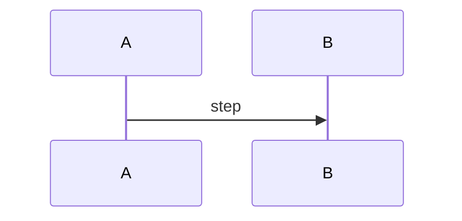

# REPLACE_ME

## Trigger · actors · preconditions

## Sequence

## Steps
| # | module | action (`path#symbol`) | table / fn / push | failure and recovery |
|---|---|---|---|---|
| 1 | | | | |

## Invariants

## Tests that pin this chain

## Modules involved
Front-matter `modules:` emits `flow:` —`groups`→ `module:` edges for the graph.

---
*Grounded in:* `REPLACE_ME#symbol` · *Last validated:* TBD, `main`, commit `TBD` ·
*Re-verify if:* TBD changes.
