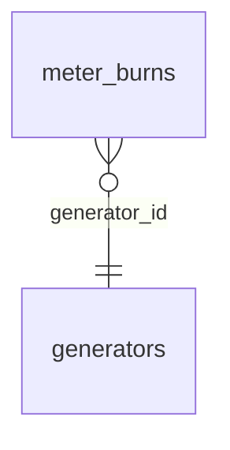

# Schema

3 tables/views across 4 schemas, introspected 2026-09-23T00:00:00Z.

## Tables

- [public.generators](public.generators.md)
- [public.meter_burns](public.meter_burns.md)
- [public.visits](public.visits.md)

## ER diagram

## Drift summary

No drift: every live table is declared in `db/*.sql`.
