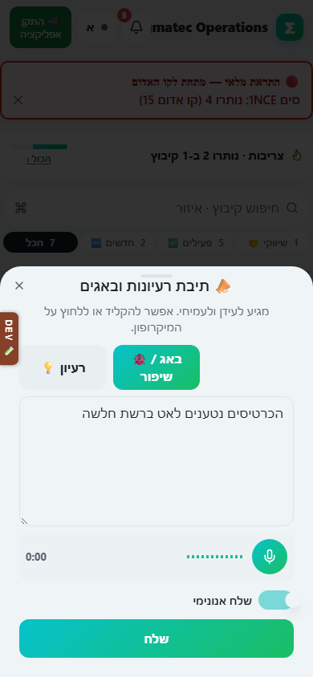

# דיווח רעיון או באג

## מה זה עושה

פותח תיבת רעיונות ובאגים שממנה אפשר לשלוח לעידן ולעמיחי רעיון לשיפור או דיווח על תקלה, בטקסט או בהקלטת קול שהופכת אוטומטית לטקסט.

## למי זה מיועדת

לכל מי שמשתמש באפליקציה, כולל מי שיש לו הרשאת צפייה בלבד. זו הדרך היחידה שגם למשתמש צפייה יש לכתוב משהו במערכת.

## איך שולחים

1. פותחים את התפריט "⋯ עוד" ובוחרים "📣 רעיון / באג".
2. בוחרים את הסוג: "💡 רעיון" או "🐞 באג / שיפור".
3. כותבים בתיבת הטקסט מה קרה או מה יעזור, או לוחצים על כפתור המיקרופון ומדברים: הדיבור הופך לטקסט בתוך התיבה תוך כדי דיבור.
4. אם ההקלטה לא מזוהה מיד, המערכת מנסה שוב לבד ומציגה זאת בשורת מצב מתחת לכפתורי הסוג.
5. אפשר לערוך את הטקסט בכל שלב, גם אחרי הקלטה, פשוט בלחיצה בתוך התיבה והקלדה.
6. אם רוצים לשלוח בלי שהשם שלכם יופיע, מדליקים את המתג "שלח אנונימי".
7. בודקים שהטקסט מתאר את הבעיה או הרעיון בצורה ברורה.
8. לוחצים "שלח". הכפתור מציג "שולח…" עד שההודעה נקלטת.

בטלפון הכל נפתח כגיליון תחתון עם כפתור מיקרופון גדול לנוחות הקלטה ביד אחת. במחשב אותו גיליון נפתח באותה צורה, ואפשר להקליד ישירות בלי מיקרופון.

## מה מקבלים בסוף

הודעה שנשלחת ישירות לעידן ולעמיחי, עם סימון אם היא רעיון או באג, ואם נשלחה בשם או אנונימית.

## טעויות נפוצות

- ללחוץ על מיקרופון בלי לתת הרשאת גישה למכשיר: המערכת תציג הודעה שההרשאה נדחתה, ואפשר להמשיך ולהקליד ידנית.
- לשלוח בלי לבחור סוג (רעיון או באג): חובה לבחור אחד מהשניים לפני השליחה.
- לצאת מהמסך באמצע הקלדה בלי לשלוח: האפליקציה שואלת לפני סגירה אם יש טקסט שלא נשלח, כדי שלא יאבד.
- לחשוב שהמתג "שלח אנונימי" נשאר דלוק לפעם הבאה: כל שליחה חדשה מתחילה מחדש, כדאי לבדוק את המתג בכל פעם.

