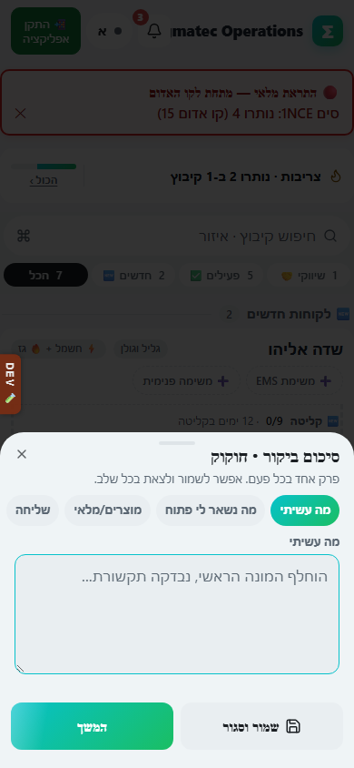
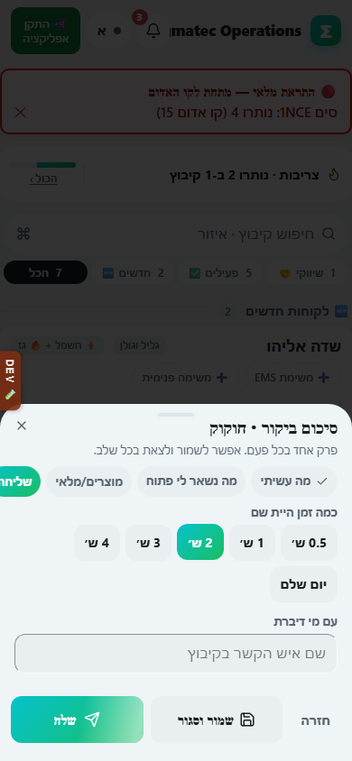
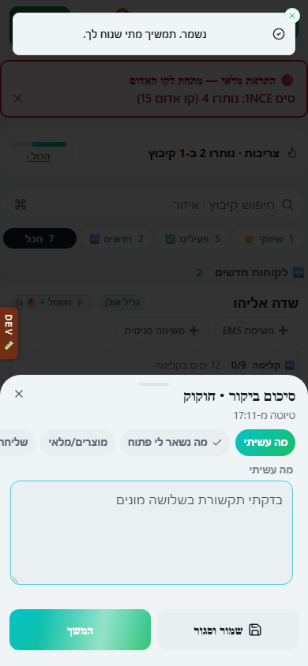

# סיכום ביקור

## מה זה עושה

זה המסך שממלאים אחרי ביקור בקיבוץ. במקום טופס ארוך אחד, הסיכום מחולק לחמישה פרקים קצרים: מה עשיתי, מה נשאר פתוח, ציוד שהושאר, תעודת משלוח אם צריך, וכמה זמן היית שם. כל פרק אפשר לשמור ולצאת ממנו בלי לאבד כלום, וההגשה בפועל קורית רק בפרק האחרון.

## למי זה מיועדת

לאביאם ולניתאי, שני אנשי השטח שמבצעים ביקורים בקיבוצים.

## איך ממלאים

1. פותחים את כרטיס הקיבוץ מהמסך הראשי או מהיומן, ולוחצים על הכפתור לסיכום ביקור (📍 "סכם ביקור").
2. פרק 1, "מה עשיתי": כותבים בטקסט חופשי מה בוצע בביקור, למשל החלפת מונה או בדיקת תקשורת.
3. לוחצים "המשך" למעבר לפרק 2, "מה נשאר לי פתוח": כותבים מה לא הושלם ונשאר לביקור הבא.
4. פרק 3 מציג את הציוד שיש במלאי אצלכם. מסמנים כמות ליד כל פריט שהשארתם בקיבוץ, ואם השארתם משהו שלא ברשימה כותבים אותו בשדה "משהו אחר שהשארת".
5. אם סימנתם ציוד בפרק 3, נפתח פרק 4 ומבקש להפיק תעודת משלוח לפני שממשיכים (ראו את המדריך "תעודת משלוח").
6. בפרק 5, "כמה זמן היית שם": בוחרים שעה מהצ'יפים (2, 3, 4 שעות וכו') או מסמנים "יום שלם", וכותבים את שם איש הקשר שדיברתם איתו בקיבוץ.
7. בכל שלב אפשר ללחוץ "שמור וסגור": הטיוטה נשמרת ואפשר לחזור אליה מאוחר יותר בדיוק מהפרק שבו עצרתם, בלי שנשלח סיכום.
8. בפרק 5 בלבד יש כפתור "שלח". לוחצים עליו רק כשסיימתם לגמרי, וזה יוצר את הביקור בפועל.

בטלפון הפרקים נפתחים כגיליון תחתון שממלאים באצבע, ובמחשב אותו גיליון נפתח באותה צורה ומתמלא עם המקלדת.

## מה מקבלים בסוף

ביקור שמור עם כל הפרטים: מה נעשה, מה נשאר פתוח, ציוד שנמסר, תעודת משלוח אם הופקה, ומשך הזמן ואיש הקשר. הביקור מופיע בהיסטוריית הביקורים של הקיבוץ ובדוח הביקורים.

## טעויות נפוצות

- לשכוח ללחוץ "שלח" בפרק 5: "שמור וסגור" רק שומר טיוטה, הביקור לא נרשם עד שלוחצים "שלח".
- לסמן ציוד בפרק 3 ולדלג על תעודת המשלוח בפרק 4: המערכת תחסום את השליחה עד שתופק תעודה.
- לא לבחור זמן שהות או לא לכתוב איש קשר בפרק 5: בלי שניהם אי אפשר לשלוח את הסיכום.
- לפתוח סיכום חדש לאותו ביקור במקום לחזור לטיוטה הקיימת: האפליקציה חוזרת אוטומטית לפרק שבו עצרתם, אין צורך להתחיל מחדש.

