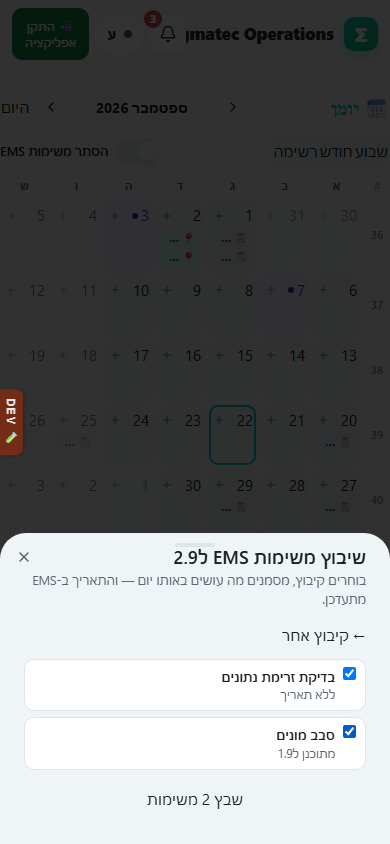
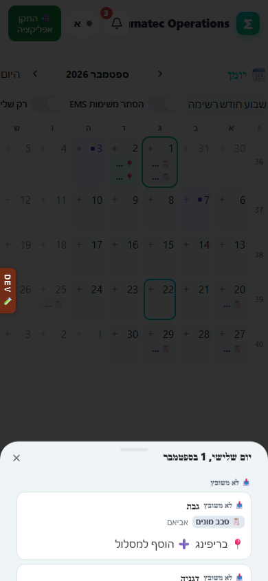

# שיבוץ ביומן

## מה זה עושה

משבץ משימות EMS ליום מסוים ביומן, ומאפשר לסדר את מסלול הביקורים של אותו יום לפי הסדר שבו רוצים להגיע לקיבוצים.

## למי זה מיועדת

לאביאם ולניתאי לתכנון יום העבודה שלהם, ולעידן ולעמיחי שרואים ומסדרים גם עבור אחרים.

## איך משבצים

1. ביומן, במעבר לתצוגת חודש או שבוע, לוחצים על היום הרצוי כדי לפתוח אותו, או לוחצים על סימן ה"➕" שמופיע על תא היום.
2. נפתח גיליון עם שלוש אפשרויות: "📋 שיבוץ משימות EMS", "➕ משימה חדשה" ו"🌴 חופש / 🪖 מילואים / 🎉 אירוע". בוחרים "📋 שיבוץ משימות EMS".
3. בוחרים קיבוץ מתוך הרשימה או מחפשים אותו.
4. מסמנים את המשימות שרוצים לשבץ מתוך רשימת המשימות הפתוחות של אותו קיבוץ.
5. לוחצים על כפתור השיבוץ שמראה כמה משימות נבחרו, וזה קובע אותן ליום שנבחר.
6. חוזרים למסך היום ובודקים ב"מסלול היום" את סדר העצירות שנוצר: כל קיבוץ מופיע כעצירה נפרדת.
7. אם רוצים לשנות את הסדר, גוררים עצירה למקום אחר במסלול, או במחשב ובלי גרירה נוחה לוחצים על החצים למעלה או למטה ליד כל עצירה.
8. אפשר גם לשבץ משימה בודדת מתוך רשימת "רשימה" (המשימות שלי): לוחצים "📅 שבץ" ליד המשימה, ואז בוחרים לאיזה יום להעביר אותה.

בטלפון הגרירה נעשית באצבע ישירות על השורה, ובמחשב אפשר לגרור עם העכבר או להשתמש בחצים.

## מה מקבלים בסוף

יום עבודה עם מסלול מסודר של קיבוצים לפי סדר הביקור, ולכל קיבוץ המשימות שנקבעו לו באותו יום. השינוי נשמר ומופיע גם ברענון מאוחר יותר וגם למי שמסתכל על היומן משם אחר.

## טעויות נפוצות

- לשבץ משימה ליום הלא נכון: כדאי לבדוק את התאריך בכותרת הגיליון לפני האישור.
- לגרור עצירה במסלול על מסך מגע בזמן שיש שדה טקסט פתוח מתחתיה: עדיף לגעת ולגרור ישירות על כותרת העצירה, לא בתוך אזור הכפתורים שלה.
- לחשוב שסימון משימה בלבד משבץ אותה: צריך גם ללחוץ על כפתור השיבוץ בסוף כדי שהבחירה תישמר.
- לנסות לשנות מסלול של קיבוץ שכבר יצא לדרך: אחרי שהביקור התחיל, השינוי במסלול לא משנה את מה שכבר נעשה, רק את הסדר של מה שנשאר.

