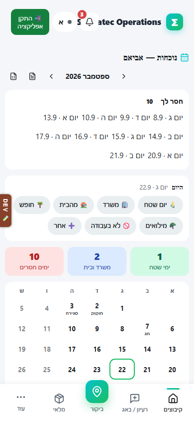
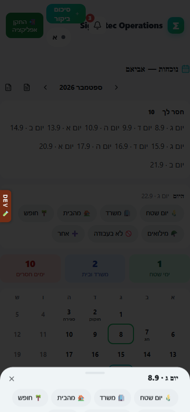
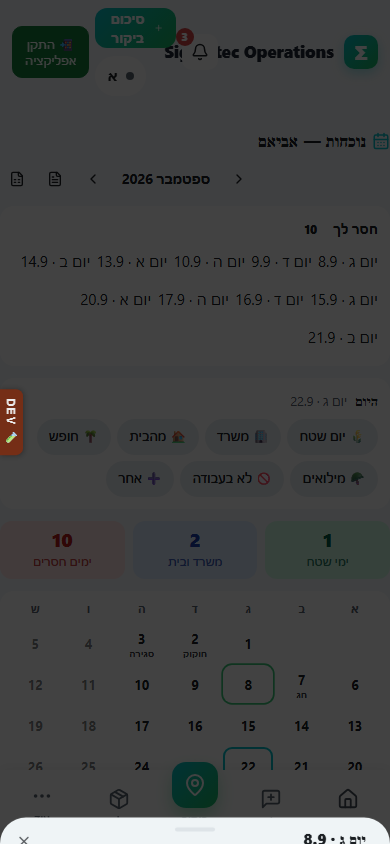

# תיעוד נוכחות

## מה זה עושה

מסך שבו מסמנים איזה סוג יום היה לכם, עוקבים אחרי ימים שעדיין חסר להם סימון, ומורידים דוח נוכחות חודשי.

## למי זה מיועד

לכל עובד לתיעוד הימים שלו. עידן ועמיחי יכולים גם לראות ולעדכן עבור כל אחד בצוות.

## איך מתעדים

1. נכנסים למסך "נוכחות". בראש המסך מופיע השם שעליו מסתכלים כרגע.
2. אם יש הרשאה לראות אנשים נוספים, בוחרים אדם מרשימת האנשים בראש המסך.
3. השורה הראשונה במסך היא "חסר לך": רשימת הימים שעדיין לא סומנו החודש. לוחצים על יום מהרשימה כדי לפתוח אותו ישר.
4. באזור "היום" למטה מהחסרים, לוחצים על סוג היום המתאים בלחיצה אחת: 🌾 יום שטח, 🏢 משרד, 🏠 מהבית, 🪖 מילואים, 🌴 חופש, 🚫 לא בעבודה, או ➕ אחר.
5. אפשר גם ללחוץ על כל יום בלוח החודשי כדי לפתוח אותו ולעדכן את סוג היום שלו, גם אם הוא כבר סומן.
6. בגיליון שנפתח אפשר להוסיף הערה חופשית בשדה "מה היה היום?", למשל פירוט על יום מיוחד.
7. לוחצים "שמירה" ליום חדש או "עדכון היום" ליום שכבר סומן. הכפתור מציג "שומר…" עד שהעדכון נקלט.
8. כדי לראות חודש אחר, לוחצים על חיצי "חודש קודם" ו"חודש הבא" בראש המסך. להורדת דוח מלא לוחצים על סמל ה־PDF או סמל ה־Excel באותה שורה.

בטלפון הלוח החודשי מוצג כרשת קטנה שנוגעים בה באצבע, ובמחשב אותה רשת נלחצת עם העכבר באותה צורה.

## מה מקבלים בסוף

חודש נוכחות מלא ומעודכן, עם שלושה מדדי סיכום למעלה, לוח חודשי צבעוני לפי סוג יום, ואפשרות להוריד דוח PDF או Excel לחודש שנבחר.

## טעויות נפוצות

- לדלג על ימים ולסמוך על הזיכרון: השורה "חסר לך" בראש המסך קיימת בדיוק כדי לתפוס את זה, כדאי לבדוק אותה קודם.
- לבחור סוג יום לא נכון בטעות בלחיצה המהירה: אפשר תמיד לפתוח את היום מהלוח ולתקן, גם אחרי שכבר סומן.
- לשכוח להחליף בחזרה לאדם הנכון אחרי שבדקתם נוכחות של מישהו אחר: השם שמופיע בראש המסך הוא מי שרואים כרגע, כדאי לוודא לפני שממשיכים לתעד.
- להוריד דוח לחודש הלא נכון: כדאי לבדוק את התווית של החודש בראש המסך לפני לחיצה על PDF או Excel.

