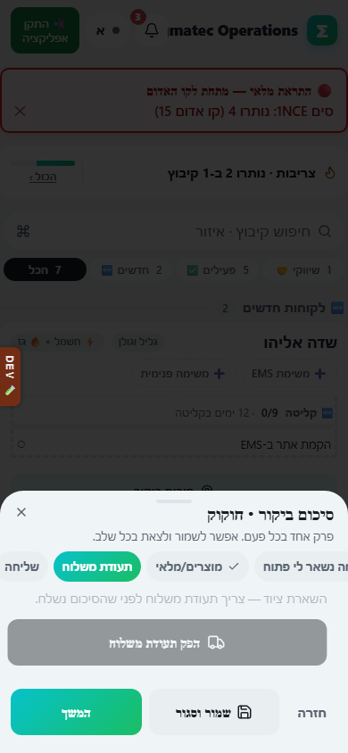

# תעודת משלוח

## מה זה עושה

מפיק תעודת משלוח רשמית על ציוד שנמסר ללקוח, עם מספר תעודה רץ, פרטי הלקוח, רשימת פריטים וחתימת המקבל. התעודה נשמרת במערכת ואפשר להדפיס אותה או לשמור אותה כ־PDF.

## למי זה מיועדת

לאביאם ולניתאי בשטח, וגם למי שמנהל הזמנות לקוח מהמשרד.

## איך מפיקים

1. יש כמה נקודות פתיחה לתעודה: מתוך סיכום ביקור כשסימנתם ציוד שהושאר בפרק 4 (כפתור "הפק תעודת משלוח"), מתוך היסטוריית הביקורים והכרטיס של הקיבוץ, מדוח הביקורים דרך "🚚 תעודת משלוח מביקור", או מתוך משימת EMS מסוג אספקת ציוד.
2. נפתח חלון תצוגה לעריכה: בודקים ומתקנים את פרטי הלקוח (שם, ח.פ, כתובת, איש קשר) ואת רשימת הפריטים והכמויות.
3. אם משהו חסר או שגוי מתקנים אותו כאן, לפני ההפקה: אחרי ההפקה התעודה כבר מקבלת מספר ונשמרת.
4. לוחצים על כפתור ההפקה. אם משתמש בהרשאת צפייה בלבד מנסה להפיק, המערכת חוסמת ומציגה הודעה שהפקת תעודות חדשות סגורה לצפייה.
5. נפתח חלון חתימה: מוסרים את המכשיר למקבל הציוד, שכותב שם מלא וחותם באצבע בתוך המסגרת.
6. בלי חתימה המערכת לא ממשיכה ומציגה הודעה שחסרה חתימה.
7. אחרי החתימה נפתח חלון הדפסה עם התעודה המוכנה, כולל מספר תעודה, פרטי הלקוח, טבלת הפריטים וסך הכל.
8. במחשב החלון עובר אוטומטית להדפסה או שמירה כ־PDF. בטלפון לוחצים על הכפתור הצף "🖨️ הדפס / שמור PDF" בפינת המסך.

## מה מקבלים בסוף

תעודת משלוח עם מספר רץ, שנשמרת במערכת ואפשר לחפש אותה מאוחר יותר, בנוסף לקובץ הדפסה או PDF להעברה ללקוח.

## טעויות נפוצות

- לנסות להפיק תעודה בלי לבחור אף פריט: המערכת תעצור ותבקש להוסיף לפחות פריט אחד.
- לשכוח למלא שם לקוח: בלי שם התעודה לא מופקת.
- לחתום מחוץ למסגרת החתימה או לדלג על החתימה: התעודה לא תופק בלי חתימה תקינה בתוך המסגרת.
- לתקן טעות אחרי ההפקה בעריכה ידנית: אחרי שהתעודה קיבלה מספר, תיקון נעשה על ידי הפקת תעודה חדשה מתקנת, לא עריכה של התעודה הישנה.
- חלון קופץ חסום בדפדפן: אם ההדפסה לא נפתחת, צריך לאפשר חלונות קופצים לאתר.

