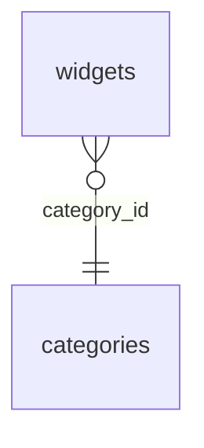

<!-- GENERATED:body -->
# Schema

2 tables/views across 4 schemas, introspected 2026-09-23T00:00:00.000Z.

## Tables

- [public.categories](public.categories.md)
- [public.widgets](public.widgets.md)

## ER diagram

## Drift summary

2 table(s) live but not declared in any `db/*.sql` by name: `public.categories`, `public.widgets`.
<!-- /GENERATED:body -->
